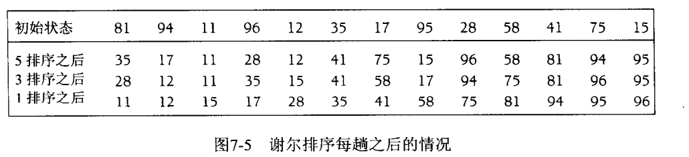
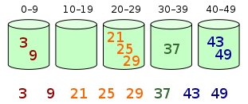

##  冒泡排序
也叫选择排序。  
在按从小到大的排序中，从第一个元素开始，依次与后面的元素对比，若后面的元素更小的则调换顺序，直到最后一个元素；之后从第二个元素开始再度循环。

## 插入排序

## shell希尔排序
一种高效的插入算法；优点是一次可以移动过非常远的距离。

有间隔的直接**插入排序**，比如gap=10； 
#### 算法过程
1. 设置gap=n，n一开始比较大，把数组分为n列，用插入排序比较每一列中相同位置的元素
2. 缩小n，重新把数组分为n列，重复第1步
3. gap=1；最后再插入排序一遍。此时由于基本已经排序好，所以交换次数非常少了。

还有一种类似的实现方法（wiki），对每列中的元素用插入排序，最后重新分为更少的几列排序。

## 桶排序
或所謂的箱排序，是一個排序演算法，工作的原理是將陣列分到有限數量的桶裡。每個桶再個別排序（有可能再使用別的排序演算法或是以遞迴方式繼續使用桶排序進行排序）。桶排序是鴿巢排序的一種歸納結果。當要被排序的陣列內的數值是均勻分配的時候，桶排序使用線性時間$$\Theta (n)$$。但桶排序並不是比较排序，他不受到$$O(n\log n)$$下限的影響

## 外部排序

考虑数据在外部磁盘中而不是内存中的时候。