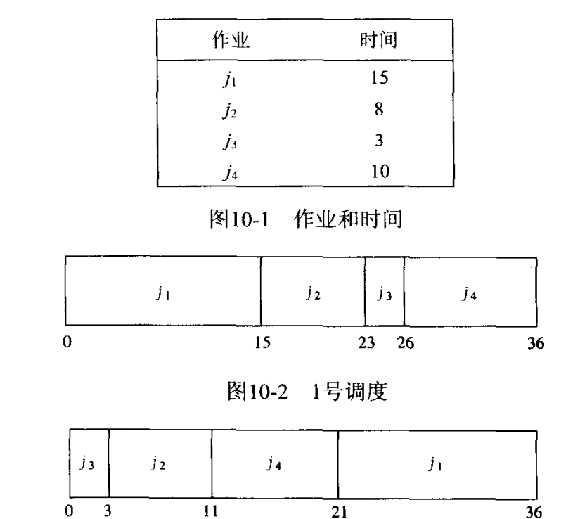
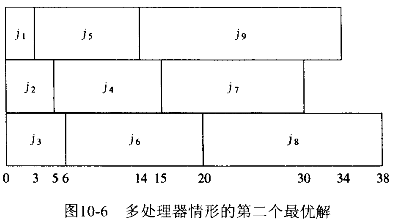
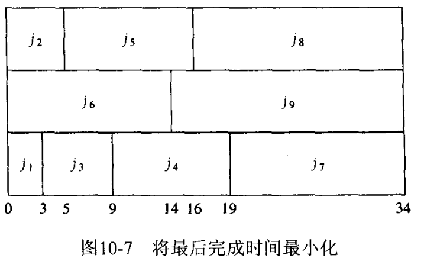
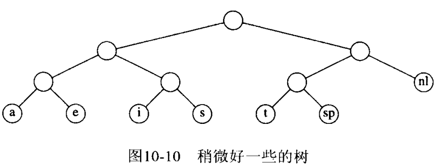
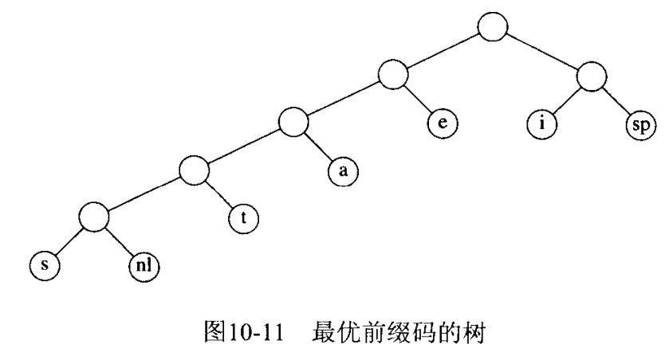
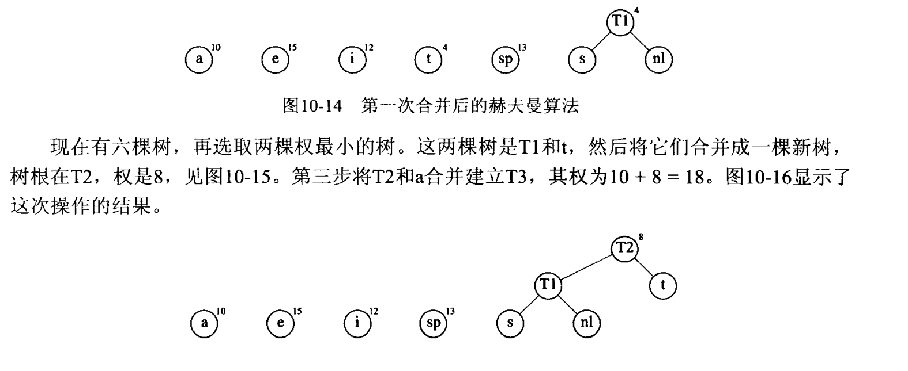

局部最优
## 1. 调度问题
### 单处理器

要是调度时间最少：即图中$$t_{i1}+t_{i2}+t_{i3}+t_{i4}$$的和最小。  
可以证明，调度的总值为：
$$C=\sum_{k=1}^N(N-k+1)t_{ik}$$
$$C=(N+1)\sum_{k=1}^N t_{ik}-\sum_{k=1}^N k \cdot t_{ik}$$

可以证明，单调非减的任何作业的调度都必然是次优的。

### 多处理器
有多个最优解；只要每个处理器上是单调递减，那么就是最优解。  

  

但是若考虑最后完成时间最小化（对于单用户拥有所有作业的情况，这是更可取的。不过**最后时间最小化显然比平均完成时间最小化要困难）  

此时如考虑平均时间最小化，这将不是最优解。

## 2. 文件压缩（赫夫曼编码）
### 问题描述
一个由字符组成的文件中，有的字符出现频率高，而有的字符出现频率低，如何减少空间，即**减少编码的长度**？传统ASCII编码是每个字符需要8个位(bit)；则总长度=字符位数\*字符长度。
### 解决思路
不再使用规定长度的编码（不固定每个字符8bit），而是让出现频率高的字符编码短，出现频率低的字符编码长。
### 实例
假设一个文件，只包含：a, e, i, s, t，空格，换行。10个a，15个e，12个i，3个s，4个t，13个空格和一个换行；因为有7个不同字符，所以每个字符只需要3bit就可以用来编码（$$3bit=111=1*2^2+1*2^1+1*2^0=7$$可以表示出7个不同的字符).

若使用二叉书来编码：如下图，父结点无值，所有左边（父/子）结点都代表0，右边代表1，则a编码是000，i是010；（注意，父结点必须是0，否则有二义性）。  

没有任何字符编码是别的字符编码的前缀，这样的叫**前缀码**；综上，一种最优的前缀码树是：

### 构造算法

## 3. 近似装箱问题
### 问题描述
有N项物品，大小为s1,s2....；0<si<=1; 把所有物品装入大小为1的箱子中，如何才能使用最小的箱子？  

