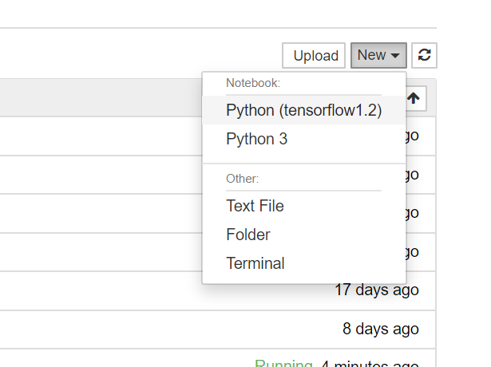

#### 1. 进入虚拟环境

```powershell
conda activate 环境名称
```

#### 2. 在当前环境里

安装ipykernel

```powershell
conda install ipykernel
```

写入kernel


```powershell
python -m ipykernel install --user --name 环境名称 --display-name "Python (环境名称)"
# python -m ipykernel install --user --name tensorflow --display-name "Python (tensorflow1.2)"
```
“环境名称”为当前虚拟环境的名称，最后面引号内的字符串是该虚拟环境显示在 Jupyter Notebook 界面的名字，可以随意修改。
#### 3. 退出虚拟环境
启动 Jupyter Notebook：




参考： https://xirikm.net/2019/319-1


注意：nb_conda只能使用python2和python3两种环境。