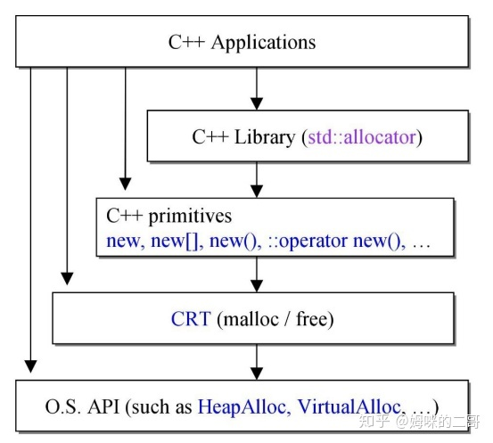

### 类别

- C函数类：malloc() / free()；不能重载；
- C++表达：new / delete； 不可以重载
- C++函数：::operator new() / ::operator delete()，可以被重载
- C++标准库：allocator::allocate() / allocator::deallocate()，可以自行设计并且在容器中使用较多

### 堆

操作系统有一个记录空闲内存地址的链表

- 系统收到程序的申请时，会遍历该链表，寻找第一个空间大于所申请空间的堆结点，然后将该结点从空闲结点链表中删 除，并将该结点的空间分配给程序
- 常说的内存泄露，最常见的就是堆泄露（还有资源泄露），它是指程序在运行中出现泄露，如果程序被关闭掉的话，操作系统会帮助释放泄露的内存

需要程序员自己申请，并指明大小，在c中malloc函数

如p1 = (char *)malloc(10);

在C++中用new运算符

如p2 = (char *)malloc(10);

但是注意p1、p2本身是在栈中的。

### 栈

在函数调用时第一个进栈的主函数中的下一条指令（函数调用语句的下一条可执行语句）的地址然后是函数 的各个参数，在大多数的C编译器中，参数是由右往左入栈，然后是函数中的局部变量。

由编译器自动分配释放 ，存放函数的参数值，局部变量的值等。其操作方式类似于数据结构中的栈。