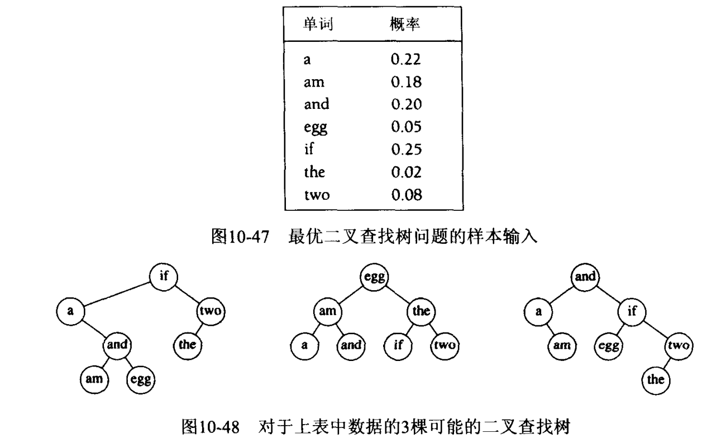
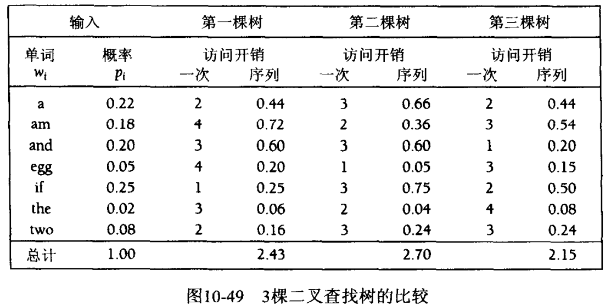

将递归算法重新写成非递归算法，让后者把子问题的答案系统地记录在一个table内地技巧。

## 用表代替递归
在斐波那契数计算过程中，递归被多次冗余调用，比如F（1）调用了N次，事实上可以把预先算出来地值存放好。

## 矩阵乘法的顺序安排
比如ABCD四个大的矩阵相乘，改变乘法顺序可以显著减少计算量。

## 最优二叉查找树
#### 问题
给定一组单词$$w_1,w_2...w_N$$，他们出现的概率$$p_i$$不同。要求以某种方法把单词放在二叉查找树中，是的总的期望访问时间最小。（在二叉查找树中，访问深度$$d$$处的一个元素所需要的比较次数是$$d+1$$；所以如果$$w_i$$放在深度$$d_i$$上，访问时间为：$$\sum^N_{i=1}p_i(1+d_i)$$。  

第一棵树是残心方法形成的，访问概率最高的放在根节点处，然后左右子树递归形成（类似赫夫曼编码？？），第二棵树是理想平衡查找树，  

可以证明，最优二叉搜索树的子树也是最优的。

## 所有点对最短路径