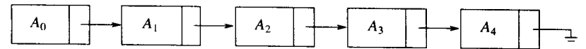

## 1. 表

  

### STL中

#### vector

在常量时间内是可索引的，但插入新项或删除已有的项代价是昂贵的。

#### List（双向）

与上图所示一样，插入和删除很容易，但是索引很难；

此外，两者的查找效率都很低

#### 栈

先进后出

#### 队列

先进先出

## 多项式

与顺序方式表示相比：  
1. 链表方便表示不定项的多项式，
2. 对于某些零系数项，执行加法运算后不再是零系数，此时需要增加新的项；
3. 对于非零项，加法后可能是零项，需要删除。

## 稀疏矩阵
使用顺序表，在矩阵运算时容易出现新项或需要消去零项，因此不太适合；  
正交链表结构更方便；  

## stl中vector与list的异同

list是双向链表

#### 相同点

- 都能在常量时间内在末尾添加/删除对象
- 子啊常量时间内访问表前/后端的项

#### list优势

- 前端高效添加/删除（vector要重新复制移动所有对象）

#### vector优势

- 随机（索引）访问