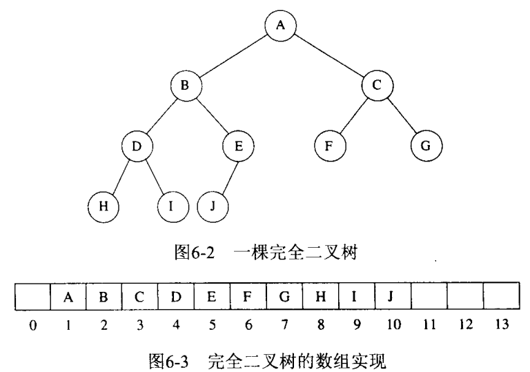

堆，也被称为优先队列，是按优先级来进行排序的，优先级可以按照大小来规定。完全二叉树只是堆的一种实现方式。而完全二叉树又由于父节点和子节点下标的数量关系而方便地用数组来存储value。

这里主要讲述优先队列如何实现。  

## 一些简单实现
1. 以**简单链表**形式，插入只需O(1)时间，并比哪里删除最小元素，这需要O(N)时间；  
2. 始终让表处于排序状态，则插入代价是O(N)，而删除最小元素是O(1)
3. 二叉查找树，插入与删除平均时间都是O(log N)

## 二叉堆
### 结构特性
堆是一棵被完全填满的二叉树；即完全二叉树。完全二叉树很有规律，所以可以用数组表示而不需要使用链表；

### 堆序性质
使操作可以快速执行的性质。比如令结点X的父结点的键小于或等于X。

### 基本操作
#### insert

#### deleteMin

#### 其他操作
堆中关于**序**的信息很少，可以考虑用散列函数。

## 优先队列的应用

