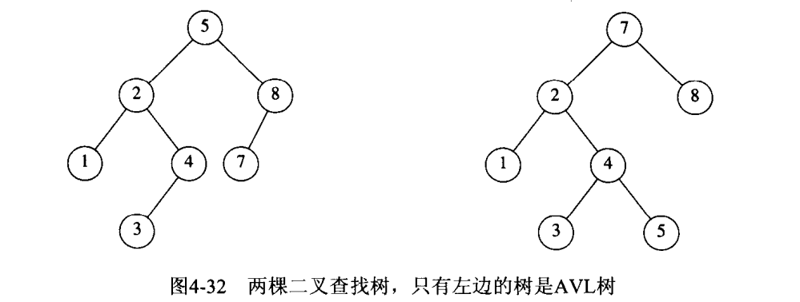
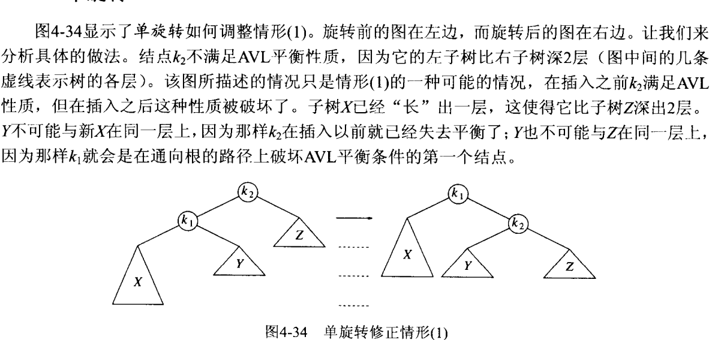
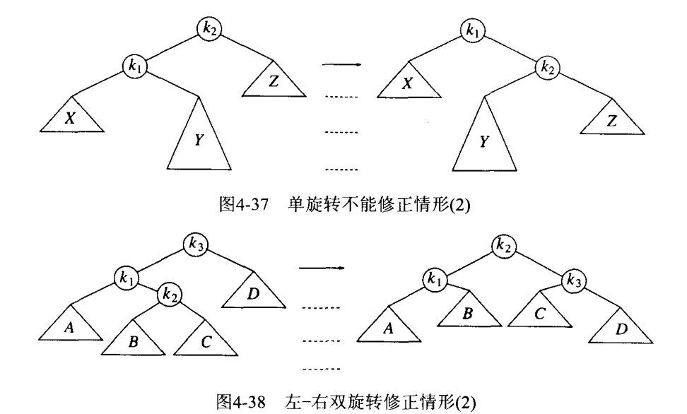

### 1.4 AVL树

如果向一棵预先排序的数插入数据，会花费二次时间，而是实现代价巨大，此时树将由没有左儿子的结点组成。一种解决办法是：用平衡树，任何结点的深度都不能过深。

有很多算法实现平衡树，但是大部分比标准二叉查找树复杂很多，花费时间很长。

AVL是一种最老的平衡查找树。较新的方法是允许树有任意深度，但每次操作后要调整，，这种叫做自调整类结构。即伸展树。

- 一种带有高度平衡条件的二叉查找树；
- 保证深度为O（log N）；

一棵AVL树是每个结点的左子树和右子树的**高度最多差1**的二叉查找树（空树的高度定义为1）。



#### 旋转

插入操作可能会破坏AVL的平衡条件，所以需要**旋转**；可能的情况为：  

1. A结点的左（右）儿子的左（右）子树进行一次插入；这种情况需要**单旋转**；
2. A结点的左（右）儿子的右（左）子树进行一次插入；这种情况需要**双旋转**；

#### 单旋转



对k2左旋意味着要把X变成左子树；（由于二叉树是排好序的，左子树一定小于结点值；目测只改变了两个指针）

#### 双旋转



先对k1子树旋转，再对旋转后的k3旋转

双旋转很明显需要用左子树的右子树作为根。

#### 编程实现

因为一次旋转总能解决问题，所以用非递归写更好，但编程实现比较难，一般还是用递归来写。

高度信息的存储：实际需要的是高度差；可以考虑用两个二进制位（+1，0，-1）表示；

```c++
struct AvlNode{
    Comparable element;
    AvlNode *left;
    AvlNode *Right;
    int height;
    AvlNode(const Comparable & theElement, AvlNode *lt, AvlNode *rt, int h=0):
    element(theElement), left(lt),right(rt),height(h)//有参构造函数
};

void rotateWithLeftChild(AvlNode * &k2){//这里传入的是指针，指向k2
    AvlNode *k1 = k2->left; //指针减少赋值开销，只存储左子树地址；
    k2->left = k1->left;
    k1->left = k2;
    k2->height = max(height(k2->left),height(k2->right))+1;
    k1->height = max(height(k1->left),k2->right)+1;
    k2 = k1; //设置新根；因为返回值是k2，这样h可以返回新根。
}

void doubleWithLeftChild(AvlNode * & k3)
{
    rotateWithLeftChild(k3->left);
    rotateWithLeftChild(k3);
}
```

