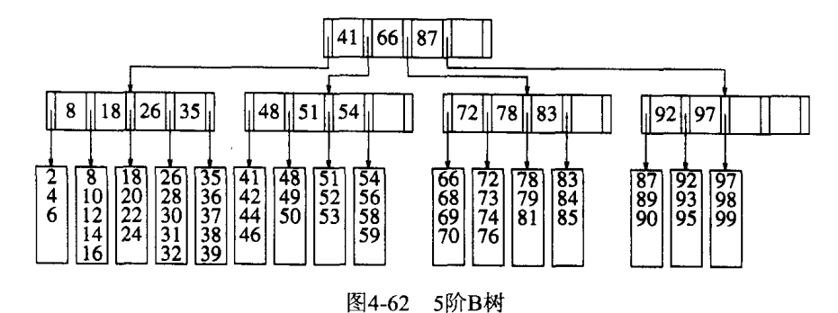

## 伸展树

Trie树(字典树)？  相对于AVL，*伸展树*的实现更为简捷。

在伸展树上的一般操作都基于伸展操作：假设想要对一个二叉查找树执行一系列的查找操作，为了使整个查找时间更小，被查频率高的那些条目就应当经常处于靠近树根的位置。于是想到设计一个简单方法，在每次查找之后对树进行調整，把被查找的条目搬移到离树根近一些的地方。伸展树应运而生。伸展树是一种自调整形式的二叉查找树，它会沿着从某个节点到树根之间的路径，通过一系列的旋转把这个节点搬移到树根去。

## 遍历

1. 前序遍历
2. 后序遍历
3. 中序遍历
4. 层序遍历：深度为d的点要在深度为d+1的结点之前处理。它不是递归地（递归默认用栈）实现，而是用队列。

## B树

B树和平衡二叉树的不同之处是：B树属于多叉树又名平衡多路查找树（查找路径不止两个），数据库索引技术里大量使用着B树和B+树的数据结构。

应对需要存储要硬盘中的场景。  
B树保证只有少量的磁盘访问。  

### M阶树结构特性

1. 数据项存储再树叶上
2. 非叶结点存储直到M-1个键，以示搜索方向；键i表示子树i+1中最小的键
3. 3
4. 除了根以外，所有非叶结点的儿子数在M/2或M之间
5. 所有叶在统统深度上右L/2到L之间个数据；

