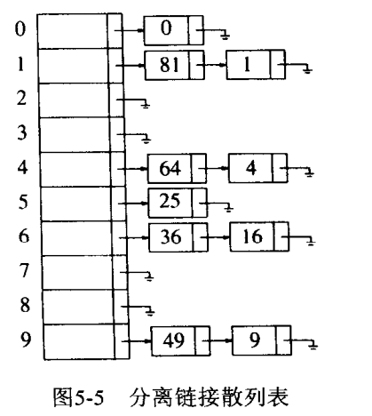

## 散列

以**常数平均时间**执行插入、删除和查找的技术。但是**无法执行排序操作**。

**散列表**（**Hash table**，也叫**哈希表**），是根据[键](https://zh.wikipedia.org/wiki/%E9%8D%B5)（Key）而直接访问在内存存储位置的[数据结构](https://zh.wikipedia.org/wiki/%E6%95%B0%E6%8D%AE%E7%BB%93%E6%9E%84)。也就是说，它通过计算一个关于键值的函数，将所需查询的数据[映射](https://zh.wikipedia.org/wiki/%E6%98%A0%E5%B0%84)到表中一个位置来访问记录，这加快了查找速度。这个映射函数称做[散列函数](https://zh.wikipedia.org/wiki/%E6%95%A3%E5%88%97%E5%87%BD%E6%95%B0)，存放记录的数组称做**散列表**。

### 构建散列表
也就是实现函数f(value)=key；这样当你要查找某一个value时，经过f函数运算，可以迅速得到key，从而找到你要的value。  
所以当中的关键就是f这个**散列函数/哈希函数**；构建函数的重要问题就是**解决冲突**，即一个key可能对应好几个value。

几种简单散列函数

- 如果键（表中对象）是整数，可以用key mode tablesize， tablesize最好是素数。
- 通常键是字符串，可以把他们的ascii码加起来

### 解决冲突的方法
#### 分离链接法
把散列到同一个值的所有元素保留到一个链表中  
可以使用标准库中表的实现方法。

除链表外，其他方案，如二叉查找树，或另加一个散列，都可以用来解决冲突。  

#### 探测散列表
查找散列表中离冲突单元最近的空闲单元，并且把新的键插入这个空闲单元。同样的，查找也同插入如出一辙：从散列函数给出的散列值对应的单元开始查找，直到找到与键对应的值或者是找到空单元。
#### 双散列

## 标准库中的散列表
STL中不包括对set和map的散列实现。不过很多编译器提供了具有与set和map类相同的成员函数hash_set and hash_map。

