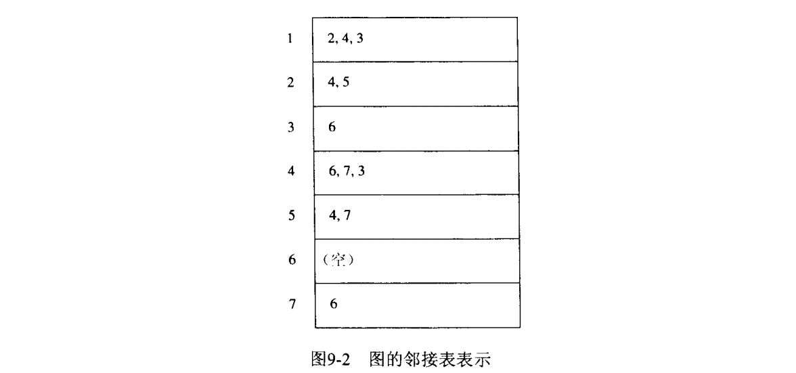
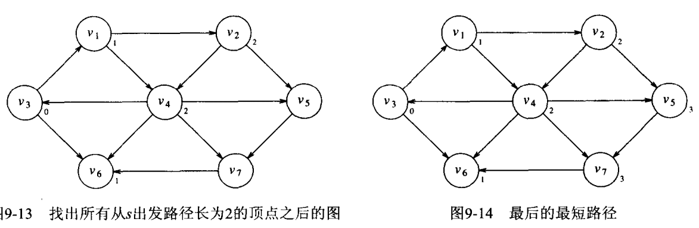
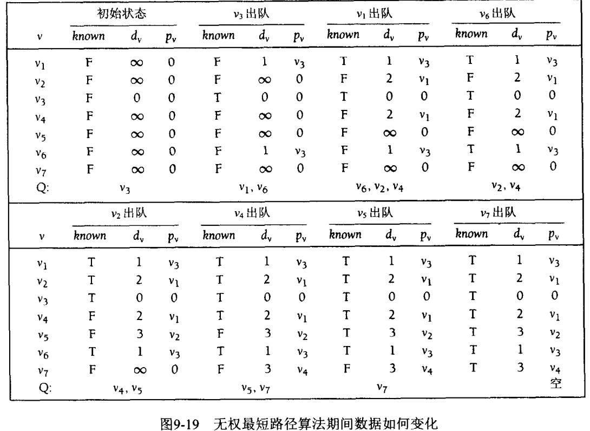
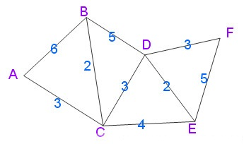

## 一些基本概念
- 图graph：由顶点vertex的集V和边edge的集E组成
- 边/弧：一个点对(v,w)；
- 无向图(List Undirected Graph)
- 有向图digraph：点对是有序的
- 邻接adjacent：当且仅当$$(v,w)\in E$$，咋一个具有边(v,w)从而具有边(w,v)的无向图中，w和v邻接且v也和w邻接
- 权weight：边的一种属性
- 路径path：一个顶点序列$$w_i, i\leq N$$，其中$$(w_i,w_{i+1})\in E$$;
- 长length：路径上的边数，等于N-1；
- 环loop：如果图含有一条从一个顶点到它自身的边$$(v,v)$$，这条路径就叫环。图一般是五环的。
- 回路cycle：满足$$w_1=w_N$$且长至少为1的一条路径。
- 无环acyclic：一个有向图没有回路。
- 连通：无向图中每一个顶点到其他每个顶点都存在一条路径，具有这样性质的有向图叫`强连通的`；
- 弱连通：若不是强连通，但`基础图`（其弧上去掉方向所形成的图）是连通的
- 完全图：每一对顶点间存在一条边的图

## 图的表示
#### 邻接矩阵
用二维矩阵表示。对于边(u,v)，令A\[u\]\[v\]=true，否则false，如果有权，可以令A\[u\]\[v\]=weight value。可以用一个很大或很小的权表示不存在的边

**特征**：  
- 空间需求很大
- 若是稀疏的，则很多浪费了。

#### 邻接表（标准方法）
对**每一个顶点，用一个表存储所邻接的顶点**，

### 存储方式

由于得到顶点的邻接顶点列表很重要，所以有两个选择；

- 图map：**键**为顶点，**值**为邻接表。简单
- 把每个邻接表作为Vertex类的成员函数处理，更快。

## 拓扑排序

## 最短路径算法
### 无权最短路径
**广度优先搜索：很像树的层序遍历**，距开始**点最近的那些顶点被首先求职**，而最远的那些顶点被最后求值。

选择s为v3；

对于每个顶点，更新三个信息：

- 把s开始到顶点的距离放入$d_v$
- $p_v$显示实施路径
- known中在顶点被处理后标记为True

出队：意思是搜索完之后删除出队？

### 有权最短路径
#### Dijkstra(迪杰斯特拉)算法
单源最短路径算法；  
特点：贪心策略，有向图，带权（无负权）；  

#### 算法步骤
1. 集S只包含源点v，v的距离为0（可以理解为v到v），U为除v外其他顶点；若v与U中的顶点u由边，<u,v>有权值，若u不是v的邻接点，权值设为$$\infty$$
2. 从U中另外选一个距离v最小的顶点k，将其加入s中；
3. 以k为新的考虑点，修改U中个顶点的距离，若从v经k到$$u_i$$的距离比不经过k段，则修改$$u_i$$的距离；

### 具有负边

### 无环图
