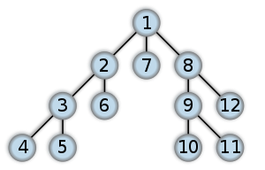

## 网络流问题
#### 问题描述
已知源点s和汇点t，求s到t的最大流量；**约束是在其他顶点，总进入流必须等于发出流**。  

### 一个简单的算法
类似贪心算法这种局部最优的方法有时无法解决全局最大流问题。

## 最小生成树
在一个无向图G中找到一个最小路径的树。  
**最小生成树存在当且仅当G是连通的**  

#### Prim算法
类似与Dijkstra算法  

两者的区别在于，每次更新路径的不一样

prim更新的是未标记集合到**已标记集合**之间的距离

Dijkstra更新的是**源点**到未标记集合之间的距离

**与Kruskal算法的区别**

Kruskal算法在加边的过程中，维护的不一定是一棵树（维护的是森林），而Prim算法始终是一棵树的延展

图1已知每条边的权重

#### kruskal算法
贪心策略，连续（并行地）按照最小权值选边，（判定）顶不构成回路时就把它作为选取的边。有余要判定回路，复杂度较高。

## 深度搜索优先
是对前序遍历的推广； 
以下是深度优先搜索的顺序。

深度优先搜索（缩写DFS）有点类似广度优先搜索，也是对一个连通图进行遍历的算法。它的思想是从一个顶点V0开始，沿着一条路一直走到底，如果发现不能到达目标解，那就返回到上一个节点，然后从另一条路开始走到底，这种尽量往深处走的概念即是深度优先的概念。

于是深度优先搜索的缺点：难以寻找最优解，仅仅只能寻找有解。其优点就是内存消耗小
