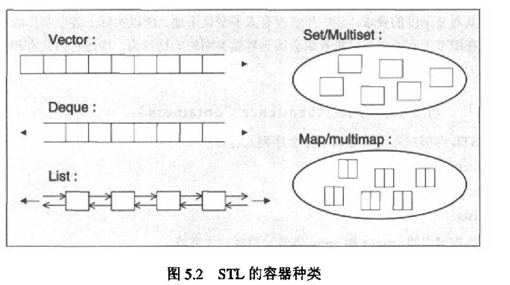

## 2.容器



可分为：
1. 序列容器：order群集，每个元素都有固定位置，如果追加6个元素，他们的排列次序与置入次序一致；STL中Array (a class called array)，vector、deque、list (singly and doubly linked)是这种；
2. 关联式容器，sorted群集，**元素位置取决与特定的排序准则**，如果追加6个元素，他们的排列次序与加入次序无关，STL中式set、multiset、map、multimap。底层实现是红黑树
3. Unordered containers：比如unordered_set； are usually implemented as hash tables

### 2.1 序列容器
#### vector
vector将元素植入dynamic array中管理，允许随机存取，在array尾部附加或移除元素非常快，但在**头部或中部则很费时**，因为为保持原来的相对次序，需要对之后的元素移动。
```C++
#include <vector>
#include <iostream>
using namespace std;
int main()
{
vector<int> coll; // vector container for integer elements
// append elements with values 1 to 6
for (int i=1; i<=6; ++i) {
coll.push_back(i);
}
// print all elements followed by a space
for (int i=0; i<coll.size(); ++i) {
cout << coll[i] << ’ ’;
}
cout << endl;
}
```

#### Deques队列
“double-ended deque"的简称，dynamic array，可以双向操作，头尾操作很快，但中间很慢；

#### Arrays
管理**固定大小**的array，也叫static array或C array，所以无法更改size，可以通过下表随机存取；  
```C++
#include <array>
#include <string>
#include <iostream>
using namespace std;
int main()
{
// array container of 5 string elements:
array<string,5> coll = { "hello", "world" };
// print each element with its index on a line
for (int i=0; i<coll.size(); ++i) {
cout << i << ": " << coll[i] << endl;
}
return 0;
}
```

#### Lists
c++11中只有一种list，之后，STL提供了class list\<\> and class forward_list\<\>；  
list\<\>是一种doubly linked list，意味着每个元素有自己的内存空间并且指向前和后；  
无法随机存取，但读取随机元素只需要线性时间（vectors和deques是常数时间）；  
lists的优势在于插入与删除非常快，无论在任何位置；

```C++
#include <list>
#include <iostream>
using namespace std;
int main()
{
list<char> coll; // list container for character elements
// append elements from ’a’ to ’z’
for (char c='a'; c<='z'; ++c){
        coll.push_back(c);
}
// print all elements:
// - use range-based for loop；这里auto可以改为char
for (auto elem : coll){
    cout << elem << " ";
}
cout << endl;
}

```
With C++11, you can declare a variable or an object without specifying its specific type by using `auto`.1 For example:
```C++
auto i = 42; // i has type int.auto必须在定义时初始化。
double f();
auto d = f(); // d has type double
```
因为element是copy每一个要处理的元素，你可以改成：
```C++
for (auto& elem : coll) {
... // any modification of elem modifies the current element in coll
}
```
#### Forward Lists
a singly linked list；

### 2.2 关联容器associative containers
by default， the containers compare the **elements or the keys (in key/value pair) with operator \<**；  
关联容器典型是用二叉树来实现的；不同的关联容器对与支持的元素和复制操作不太一样。  
关联容器的主要**优势**在于：find元素很快（因为它具有log复杂度）；  
**缺点是**你不能直接修改value，因为这样破坏了元素间的顺序。  

- A `set` is a collection in which elements are sorted according to their own values. Each element may occur only once, so **duplicates are not allowed**.
- A `multiset`  is the same as a set except that duplicates are allowed. Thus, a multiset may contain multiple elements that have the **same value**.
- A `map` contains elements that are key/value pairs. Each element has a key that is the basis for the sorting criterion and a value. Each key may occur only once, so **duplicate keys are not allowed**. A `map` can also be used as an associative array, an array that has an arbitrary index type
- multimap is the same as a map except that duplicates are allowed. Thus, a multimap may
  contain **multiple elements that have the same key**. A multimap can also be **used as dictionary**
```C++
#include <set>
#include <string>
#include <iostream>
using namespace std;
int main()
{
set<string> cities {
"Braunschweig", "Hanover", "Frankfurt", "New York",
"Chicago", "Toronto", "Paris", "Frankfurt"
};
// print each element:
for (const auto& elem : cities) {
cout << elem << " ";
}
cout << endl;
// insert additional values:
cities.insert( {"London", "Munich", "Hanover", "Braunschweig"} );
// print each element:
for (const auto& elem : cities) {
cout << elem << " ";
}
cout << endl;
}
```
```C++
#include <map>
#include <string>
#include <iostream>
using namespace std;
int main()
{
multimap<int,string> coll; // container for int/string values
// insert some elements in arbitrary order
// - a value with key 1 gets inserted twice
coll = { {5,"tagged"},
{2,"a"},
{1,"this"},
{4,"of"},
{6,"strings"},
{1,"is"},
{3,"multimap"} };
// print all element values
// - element member second is the value
for (auto elem : coll) {
cout << elem.first <<":" << elem.second << ’ ’;
}
cout << endl;
}
```
对于相同的key，c++11之前没有什么处理方法。在C++11中，先插入的在前面，后插入的在后面。

### 2.3 unordered containers
are typically implemented as a `hash table`；  
所以容器时一个array of linked lists；  
**优势**在于find非常快；不过找到一个好的hash function非常不容易  
-  An `unordered set` is a collection of unordered elements, where each element may occur only
  once. Thus, duplicates are not allowed.
-  An `unordered multiset` is the same as an unordered set except that duplicates are allowed. Thus, an unordered multiset may contain multiple elements that have the same value.
-  An `unordered map` contains elements that are key/value pairs. Each key may occur only once,
  so duplicate keys are not allowed. An unordered map can also be used as an associative array,
  an array that has an arbitrary index type (see Section 6.2.4, page 185, for details).
-  An `unordered multimap` is the same as an unordered map except that duplicates are allowed. Thus, an unordered multimap may contain multiple elements that have the same key. An unordered multimap can also be used as dictionary

可以把unordered set看作一种特殊的unordered map；

```C++
#include <unordered_set>
#include <string>
#include <iostream>
using namespace std;
int main()
{
unordered_multiset<string> cities {
"Braunschweig", "Hanover", "Frankfurt", "New York",
"Chicago", "Toronto", "Paris", "Frankfurt"
};
// print each element:
for (const auto& elem : cities) {
cout << elem << " ";
}
cout << endl;
// insert additional values:
cities.insert( {"London", "Munich", "Hanover", "Braunschweig"} );
// print each element:
for (const auto& elem : cities) {
cout << elem << " ";
}
cout << endl;
}
```
### 2.3 关联数组
map和unordered map都可以看作一种关联数组：索引不是整数，而是其他key。\[\]是下标操作符。  