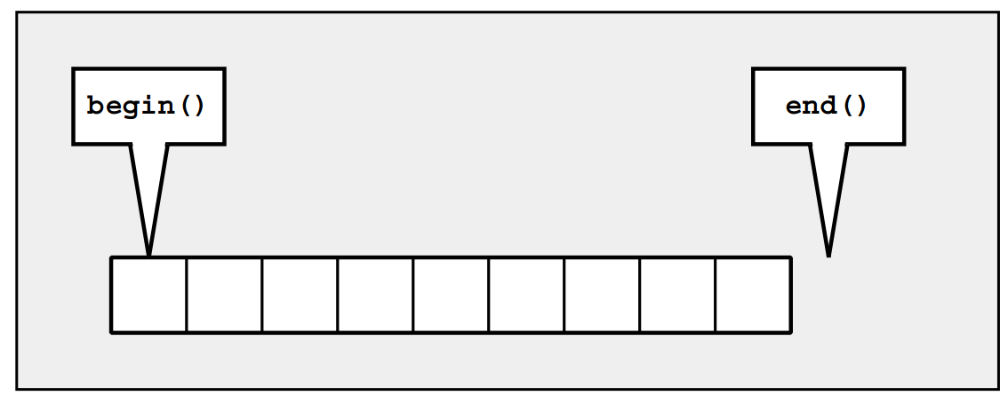

# Iterators

用来遍历所有元素，找到需要的元素并操作；
- Operator * returns the element of the **current position**. If the elements have members, you can
use operator -> to access those members directly from the iterator.
- Operator ++ lets the iterator step forward to the next element. Most iterators also allow stepping
backward by using operator --.
- Operators == and != return whether **two iterators represent the same position**.
- Operator = assigns an iterator (the position of the element to which it refers)

与指针相比，iterator更类似与智能指针，可以指向容器中复杂的数据体。每一种容器都有自己独特的iterator，但拥有相同的接口。  

比较重要的几个接口：
- begin()：初始元素的位置
- end()：最后一个元素；The end is the position behind the last element. Such an iterator is also called a past-the-end iterator



#### ++pos versus pos++
++pos是用来移动到下一个元素，比pos++要快；因为pos++包含一个temporary object用来返回old position。

#### cbegin() and cend()
从C++11开始，可以用关键字 `auto`指定正确的iterator类型（假定你在声明时初始化iterator），比如，如果不用auto：
```C++
for (list<char>::const_iterator pos = coll.begin();
pos != coll.end();
++pos) {
cout << *pos << ’ ’;
}
```
用了auto之后：  
```C++
for (auto pos = coll.begin(); pos != coll.end(); ++pos) {
cout << *pos << ’ ’;
}
```

但是缺点是iterator失去了constness，容易出现不可预知的问题。从C++11开始cbegin() and cend() are provided as container functions since C++11. They return an object of type cont::const_iterator 

#### Range-Based for Loops versus Iterators

> for (type elem : coll) {
> ...
> }

is interpreted as

> for (auto pos=coll.begin(), end=coll.end(); pos!=end; ++pos) {
> type elem = *pos;
> ...
> }

```C++
for (auto pos = coll.begin(); pos != coll.end(); ++pos) {
...
}
\\ However, the following does not work with all containers:
for (auto pos = coll.begin(); pos < coll.end(); ++pos) {
...
}
Operator < is provided only for random-access iterators, so this loop does not work with lists, sets, and maps.
```


| 成员方法         | 功能                                                         |
| ---------------- | ------------------------------------------------------------ |
| begin()          | 返回指向容器中第一个（注意，是已排好序的第一个）键值对的双向迭代器。如果 map 容器用 const 限定，则该方法返回的是 const 类型的双向迭代器。 |
| end()            | 返回指向容器最后一个元素（注意，是已排好序的最后一个）所在位置后一个位置的双向迭代器，通常和 begin() 结合使用。如果 map 容器用 const 限定，则该方法返回的是 const 类型的双向迭代器。 |
| rbegin()         | 返回指向最后一个（注意，是已排好序的最后一个）元素的反向双向迭代器。如果 map 容器用 const 限定，则该方法返回的是 const 类型的反向双向迭代器。 |
| rend()           | 返回指向第一个（注意，是已排好序的第一个）元素所在位置前一个位置的反向双向迭代器。如果 map 容器用 const 限定，则该方法返回的是 const 类型的反向双向迭代器。 |
| cbegin()         | 和 begin() 功能相同，只不过在其基础上，增加了 const 属性，不能用于修改容器内存储的键值对。 |
| cend()           | 和 end() 功能相同，只不过在其基础上，增加了 const 属性，不能用于修改容器内存储的键值对。 |
| crbegin()        | 和 rbegin() 功能相同，只不过在其基础上，增加了 const 属性，不能用于修改容器内存储的键值对。 |
| crend()          | 和 rend() 功能相同，只不过在其基础上，增加了 const 属性，不能用于修改容器内存储的键值对。 |
| find(key)        | 在 map 容器中查找键为 key 的键值对，如果成功找到，则返回指向该键值对的双向迭代器；反之，则返回和 end() 方法一样的迭代器。另外，如果 map 容器用 const 限定，则该方法返回的是 const 类型的双向迭代器。 |
| lower_bound(key) | 返回一个指向当前 map 容器中第一个大于或等于 key 的键值对的双向迭代器。如果 map 容器用 const 限定，则该方法返回的是 const 类型的双向迭代器。 |
| upper_bound(key) | 返回一个指向当前 map 容器中第一个大于 key 的键值对的迭代器。如果 map 容器用 const 限定，则该方法返回的是 const 类型的双向迭代器。 |
| equal_range(key) | 该方法返回一个 pair 对象（包含 2 个双向迭代器），其中 pair.first 和 lower_bound() 方法的返回值等价，pair.second 和 upper_bound() 方法的返回值等价。也就是说，该方法将返回一个范围，该范围中包含的键为 key 的键值对（map 容器键值对唯一，因此该范围最多包含一个键值对）。 |