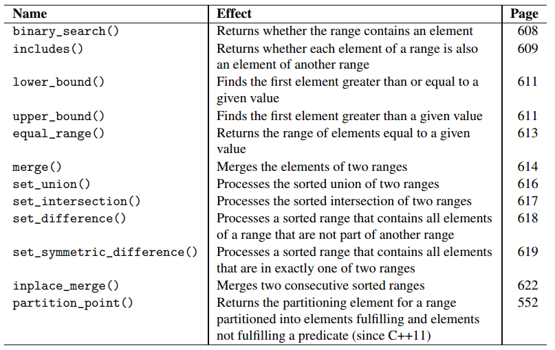
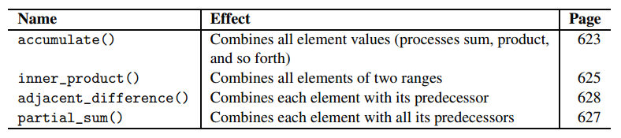

- Algorithms offer fundamental services, such as **such as searching, sorting, copying, reordering, modifying, and numeric processing**;  
- Algorithms are not member function of the container classe but instead are **global functions that operate with iterators**.
- 优点是可以操作不同容器中的元素，
- 缺点：用法不直观；一些数据结构的联合体可能无法使用这些算法或者不好用。

```C++
#include <algorithm>
#include <vector>
#include <iostream>
using namespace std;
int main()
{
// create vector with elements from 1 to 6 in arbitrary order
vector<int> coll = { 2, 5, 4, 1, 6, 3 };
// find and print minimum and maximum elements
auto minpos = min_element(coll.cbegin(),coll.cend());
cout << "min: " << *minpos << endl;
auto maxpos = max_element(coll.cbegin(),coll.cend());
cout << "max: " << *maxpos << endl;
// sort all elements
sort (coll.begin(), coll.end());
// find the first element with value 3
// - no cbegin()/cend() because later we modify the elements pos3 refers to
auto pos3 = find (coll.begin(), coll.end(), // range
3); // value
// reverse the order of the found element with value 3 and all following elements
reverse (pos3, coll.end());
// print all elements
for (auto elem : coll) {
cout << elem << " ";
}
cout << endl;
}
```
注意，这里`min_elemen`t函数用的cbegin()迭代（用begin()也可以），而`sort`函数用的begin()，因为sort会改变velue of the elements。  
`find`函数返回value的pos，**如果fail，返回end of range，也就是end()**，  
`reverse`把iterator之间的元素翻转；所以也不能用const iterator；

### 1.1 range
iterators的范围是：[pos1, pos2); or [pos1, pos2-1];  
注意要确保pos1的范围在前面，但是除了随机存取的容器可以用`<`判断，其他容器不能判断位置i先后，需要用编程技巧。 

### 1.2 multiple ranges
```C++
if (equal (coll1.begin(), coll1.end(), // first range
coll2.begin())) { // second range
...
}```
这里对(coll1.begin(), coll1.end()）里的数和coll2里的一一比较，同时coll2比较的范围由(coll1.begin(), coll1.end()）的元素数目决定了。  
这引出一个**大前提**：比较前确保coll2的元素数目大于或等于coll1！！。


```

**事实上，每个容器还有自己独特的成员函数拥有部分algorithms的功能。比如成员函数中的remove比algorithm中的remove好用**。

## 算法成员函数

| Name | Effect Page|
|---|---|
| for_each()|  Performs an operation for each element|
| count()|  Returns the number of elements| |
| count_if()|  Returns the number of elements that match a criterion |
| min_element()|  Returns the element with the smallest value |
| max_element()|  Returns the element with the largest value|
|minmax_element() |  Returns the elements with the smallest and largest value (since C++11)|
| find()|  Searches for the first element with the passed value |
| find_if()|  Searches for the first element that matches a criterion |
| find_if_not()|  Searches for the first element that matches a criterion not(since C++11)|
| search_n()| | Searches for the first n consecutive elements with certainproperties|
|search()| Searches for the first occurrence of a subrange|
|find_end()| Searches for the last occurrence of a subrange|
|find_first_of()| Searches the first of several possible elements|
|adjacent_find()| Searches for two adjacent elements that are equal (by somecriterion)|
|equal() |Returns whether two ranges are equal|
|is_permutation()| Returns whether two unordered ranges contain equal elements(since C++11)|
|mismatch()| Returns the first elements of two sequences that differ|
|lexicographica|l... Returns whether a range is lexicographically less than|
|_compare()| another range|
|s_sorted() |Returns whether the elements in a range are sorted (sinceC++11)|
| is_sorted_until()|  Returns the first unsorted element in a range (since C++11) |
| is_partitioned()|  Returns whether the elements in a range are partitioned in twogroups according to a criterion (since C++11)|
| partition_point()|  Returns the partitioning element for a range partitioned into elements fulfilling and elements not fulfilling a predicate (since C++11)|
| is_heap()|  Returns whether the elements in a range are sorted as a heap (since C++11)|
| is_heap_until()|  Returns the first element in a range not sorted as a heap (since C++11)|
| all_of()|  Returns whether all elements match a criterion (since C++11) |
| any_of()|  Returns whether at least one element matches a criterion(since C++11)|
| none_of()|  Returns whether none of the elements matches a criterion(since C++11) |




