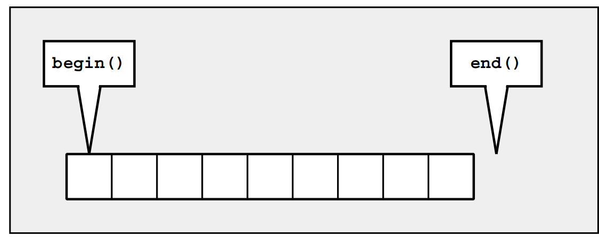

# Iterators

用来遍历所有元素，找到需要的元素并操作；
- Operator * returns the element of the **current position**. If the elements have members, you can
use operator -> to access those members directly from the iterator.
- Operator ++ lets the iterator step forward to the next element. Most iterators also allow stepping
backward by using operator --.
- Operators == and != return whether **two iterators represent the same position**.
- Operator = assigns an iterator (the position of the element to which it refers)

与指针相比，iterator更类似与智能指针，可以指向容器中复杂的数据体。每一种容器都有自己独特的iterator，但拥有相同的接口。  

比较重要的几个接口：
- begin()：初始元素的位置
- end()：最后一个元素；The end is the position behind the last element. Such an iterator is also called a past-the-end iterator



#### ++pos versus pos++
++pos是用来移动到下一个元素，比pos++要快；因为pos++包含一个temporary object用来返回old position。
#### cbegin() and cend()
从C++11开始，可以用关键字 `auto`指定正确的iterator类型（假定你在声明时初始化iterator），比如，如果不用auto：
```C++
for (list<char>::const_iterator pos = coll.begin();
pos != coll.end();
++pos) {
cout << *pos << ’ ’;
}
```
用了auto之后：  
```C++
for (auto pos = coll.begin(); pos != coll.end(); ++pos) {
cout << *pos << ’ ’;
}
```

但是缺点是iterator失去了constness，容易出现不可预知的问题。从C++11开始cbegin() and cend() are provided as container functions since C++11. They return an object of type cont::const_iterator 

#### Range-Based for Loops versus Iterators

> for (type elem : coll) {
> ...
> }

is interpreted as

> for (auto pos=coll.begin(), end=coll.end(); pos!=end; ++pos) {
> type elem = *pos;
> ...
> }

```C++
for (auto pos = coll.begin(); pos != coll.end(); ++pos) {
...
}
\\ However, the following does not work with all containers:
for (auto pos = coll.begin(); pos < coll.end(); ++pos) {
...
}
Operator < is provided only for random-access iterators, so this loop does not work with lists, sets, and maps.
```