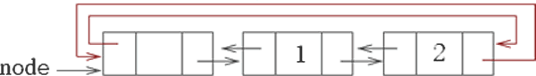

[STL](http://c.biancheng.net/stl/) list 容器，又称双向链表容器，即该容器的底层是以双向链表的形式实现的。这意味着，list 容器中的元素可以分散存储在内存空间里，而不是必须存储在一整块连续的内存空间中。

图 1 展示了 list 双向链表容器是如何存储元素的。

图 1 list 双向链表容器的存储结构示意图

### 迭代器

**序列容器中唯一拥有双向迭代器**

### 底层实现

由此可以总结出，list 容器实际上就是一个带有头节点的双向循环链表。如图 2 所示，此为存有 2 个元素的 list 容器：

图 1 list 容器底层存储示意图