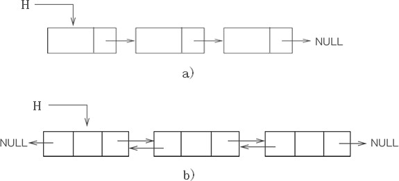

forward_list 是 [C++](http://c.biancheng.net/cplus/) 11 新添加的一类容器，其底层实现和 list 容器一样，采用的也是链表结构，只不过 forward_list 使用的是单链表，而 list 使用的是双向链表（如图 1 所示）。

图 1 单链表（ a) ）和双向链表（ b) ）

> 图 1 中，H 表示链表的表头。

通过图 1 不难看出，使用链表存储数据最大的特点在于，其并不会将数据进行集中存储（向数组那样），换句话说，链表中数据的存储位置是分散的、随机的，整个链表中数据的线性关系通过[指针](http://c.biancheng.net/c/80/)来维持。

因此，forward_list 容器具有和 list 容器相同的特性，即擅长在序列的任何位置进行插入元素或删除元素的操作，但对于访问存储的元素，没有其它容器（如 array、vector）的效率高。

没有双向迭代器（反向迭代器）

当然有，forward_list 容器底层使用单链表，也不是一无是处。比如，存储相同个数的同类型元素，单链表耗用的内存空间更少，空间利用率更高，并且对于实现某些操作单链表的执行效率也更高。

> 效率高是选用 forward_list 而弃用 list 容器最主要的原因，换句话说，只要是 list 容器和 forward_list 容器都能实现的操作，应优先选择 forward_list 容器。

参考：[C++ STL forward_list容器完全攻略 (biancheng.net)](http://c.biancheng.net/view/6960.html)