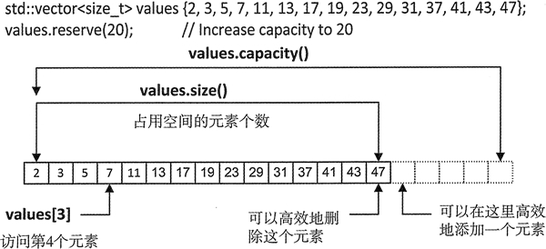

### array

和普通数组一样，但是定义了很多方法（成员函数），更易于使用，开发效率更高。

```C++
namespace std{
    template <typename T, size_t N>
    class array;
}
```

### vector

vector和array的区别是他没有固定大小，会动态扩充内存（会影响效率）。

#### 初始化

```C++
std::vector<double> values;
values.reserve(20); // 使用reserve预留大小，避免频繁扩充内存
```

或者用初始化来确定大小

```C++
std::vector<int> primes {2, 3, 5, 7, 11, 13, 17, 19};
std::vector<double> values(20);//默认值为0.0
std::vector<double> values(20, 1.0);//指定值为1.0
```

圆括号 () 中的 2 个参数，既可以是常量，也可以用变量来表示

还可以用其他vector的数值来初始化

```C++
int array[]={1,2,3};
std::vector<int>values(array, array+2);//values 将保存{1,2}
std::vector<int>value1{1,2,3,4,5};
std::vector<int>value2(std::begin(value1),std::begin(value1)+3);//value2保存{1,2,3}
```

#### 成员函数

```C++
value.insert(value.begin(), 'C');
values.size(); //返回实际元素个数
values.capacity(); //返回容量大小（可用个数）
```



#### 迭代器

由于vector会自动扩容，要避免在使用迭代器时更改尺寸大小导致迭代器失效。

#### 修改容量和大小

- `reserve()`增加容器的容量（但并不会改变存储元素的个数）
- `resize()`改变容器的大小，并且该函数也可能会导致 vector 容器容量的增加

```C++
#include <iostream>
#include <vector>
using namespace std;
int main()
{
    vector<int>value{ 2,3,5,7,11,13,17,19,23,29,31,37,41,43,47 };
    cout << "value 容量是：" << value.capacity() << endl;
    cout << "value 大小是：" << value.size() << endl;
    value.reserve(20);
    cout << "value 容量是(2)：" << value.capacity() << endl;
    cout << "value 大小是(2)：" << value.size() << endl;
    //将元素个数改变为 21 个，所以会增加 6 个默认初始化的元素
    value.resize(21);
    //将元素个数改变为 21 个，新增加的 6 个元素默认值为 99。
    //value.resize(21,99);
    //当需要减小容器的大小时，会移除多余的元素。
    //value.resize(20);
    cout << "value 容量是(3)：" << value.capacity() << endl;
    cout << "value 大小是(3)：" << value.size() << endl;
    return 0;
}
```

结果

> value 容量是：15
> value 大小是：15
> value 容量是(2)：20
> value 大小是(2)：15
> value 容量是(3)：30
> value 大小是(3)：21

#### 容量和大小的数据类型

```C++
vector<int>::size_type cap = value.capacity();
vector<int>::size_type size = value.size();
```

size_type 类型是定义在由 vector 类模板生成的 vector 类中的，它表示的真实类型和操作系统有关，在 32 位架构下普遍表示的是 unsigned int 类型，而在 64 位架构下普通表示 unsigned long 类型。

当然，我们还可以使用 auto 关键字代替 vector<int>::size_type，比如：

```c++
auto cap = value.capacity();
auto size = value.size();
```