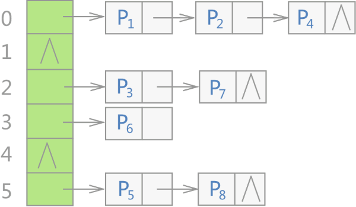

无序容器存储键值对时，会先申请一整块连续的存储空间，但此空间并不用来直接存储键值对，而是**存储各个链表的头指针**，各键值对真正的存储位置是各个链表的节点。

#### 负载因子

用于衡量容器存储键值对的空/满程序，即负载因子越大，意味着容器越满，即各链表中挂载着越多的键值对，这无疑会降低容器查找目标键值对的效率；反之，负载因子越小，容器肯定越空，但并不一定各个链表中挂载的键值对就越少。

| 成员方法           | 功能                                                         |
| ------------------ | ------------------------------------------------------------ |
| bucket_count()     | 返回当前容器底层存储键值对时，使用桶的数量。                 |
| max_bucket_count() | 返回当前系统中，unordered_map 容器底层最多可以使用多少个桶。 |
| bucket_size(n)     | 返回第 n 个桶中存储键值对的数量。                            |
| bucket(key)        | 返回以 key 为键的键值对所在桶的编号。                        |
| load_factor()      | 返回 unordered_map 容器中当前的负载因子。                    |
| max_load_factor()  | 返回或者设置当前 unordered_map 容器的最大负载因子。          |
| rehash(n)          | 尝试重新调整桶的数量为等于或大于 n 的值。如果 n 大于当前容器使用的桶数，则该方法会是容器重新哈希，该容器新的桶数将等于或大于 n。反之，如果 n 的值小于当前容器使用的桶数，则调用此方法可能没有任何作用。 |
| reserve(n)         | 将容器使用的桶数（bucket_count() 方法的返回值）设置为最适合存储 n 个元素的桶数。 |
| hash_function()    | 返回当前容器使用的哈希函数对象。                             |

```C++
#include <iostream>
#include <string>
#include <unordered_map>
using namespace std;
int main()
{
    //创建空 umap 容器
    unordered_map<string, string> umap;
   
    cout << "umap 初始桶数: " << umap.bucket_count() << endl;
    cout << "umap 初始负载因子: " << umap.load_factor() << endl;
    cout << "umap 最大负载因子: " << umap.max_load_factor() << endl;
    //设置 umap 使用最适合存储 9 个键值对的桶数
    umap.reserve(9);
    cout << "*********************" << endl;
    cout << "umap 新桶数: " << umap.bucket_count() << endl;
    cout << "umap 新负载因子: " << umap.load_factor() << endl;
    //向 umap 容器添加 3 个键值对
    umap["Python教程"] = "http://c.biancheng.net/python/";
    umap["Java教程"] = "http://c.biancheng.net/java/";
    umap["Linux教程"] = "http://c.biancheng.net/linux/";
    //调用 bucket() 获取指定键值对位于桶的编号
    cout << "以\"Python教程\"为键的键值对，位于桶的编号为:" << umap.bucket("Python教程") << endl;
    //自行计算某键值对位于哪个桶
    auto fn = umap.hash_function();
    cout << "计算以\"Python教程\"为键的键值对，位于桶的编号为：" << fn("Python教程") % (umap.bucket_count()) << endl;
    return 0;
}
```

结果

> umap 初始桶数: 8
> umap 初始负载因子: 0
> umap 最大负载因子: 1
> *********************
> umap 新桶数: 16
> umap 新负载因子: 0
> 以"Python教程"为键的键值对，位于桶的编号为:9
> 计算以"Python教程"为键的键值对，位于桶的编号为：9

### 迭代器

最大变化是没有反向迭代器了。