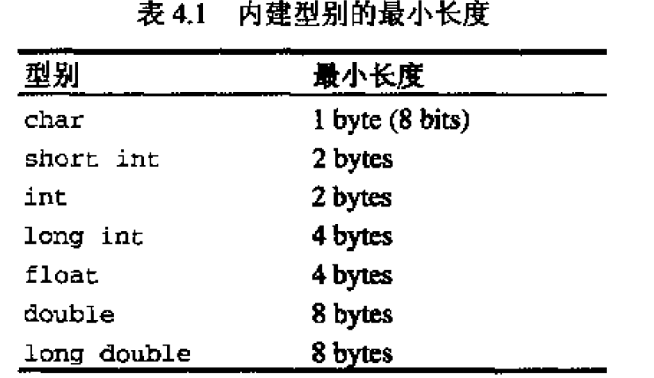
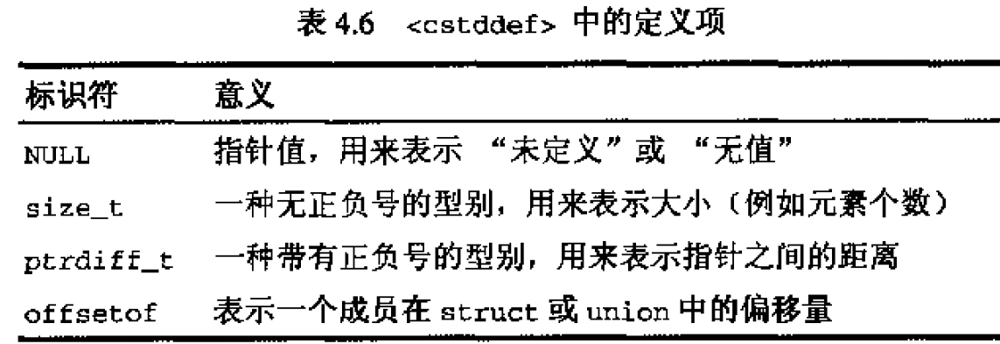
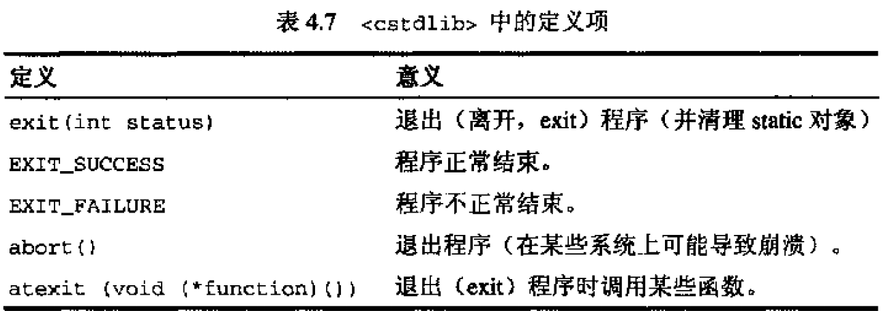

## general type
### 1. pairs对组
class pair将两个值视为一个单元，C++标准程序库内多出使用这个class。容器类别map和multimap，就是用pairs管理其key/value；

structure pair定义于\<utility\>中，注意这里pair定义为struct而不是class，所以其成员都是public。
#### 实际应用
map和multimap中的元素类型就是pair。C++标准程序库中凡是“必须返回两个值”的函数，都会利用pair对象。

## 智能指针

## 数值极限Numerical limits
用以写出与平台无关的程序。  



## 4. 辅助函数
### 比较大小
定义与头文件\<algorithm\>；  
min和max函数。  
定义：
```C++
namespace std{
    template <class T>
    inline const T& min(const T& a, cosnt T& b){
        return b<a?b:a;
        \\ max() function is same.
    }
}
```
如果两值相等，通常返回第一值，对号不要依赖这一点！  

还有一种定义，可以比较特定值的大小：
```C++
namespace std{
    template <class T， class Compare>
    inline const T& min(const T& a, cosnt T& b){
        return Comp(b,a)?b:a;
        \\ max() function is same.
    }
}
```
Compare一般是一个函数；

### 交换
swap()；优势在于不需要反复赋值，可以大大节约时间。  

## \<cstddef\> and \<cstdlib\>
与对应的c版本兼容。  






