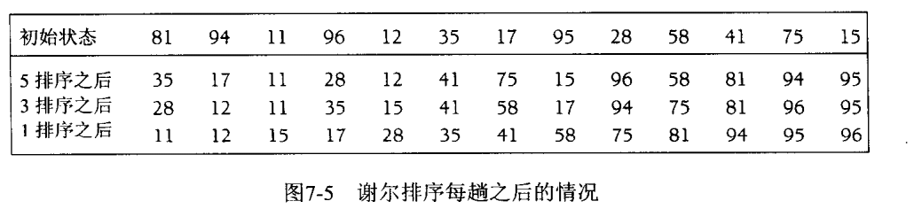

##  冒泡排序
也叫选择排序。  
在按从小到大的排序中，从第一个元素开始，依次与后面的元素对比，若后面的元素更小的则调换顺序，直到最后一个元素；之后从第二个元素开始再度循环。

## 插入排序


## shell希尔排序
一种高效的插入算法；优点是一次可以移动过非常远的距离。

有间隔的直接**插入排序**，比如gap=10； 
#### 算法过程
1. 设置gap=n，n一开始比较大，把数组分为n列，用插入排序比较每一列中相同位置的元素
2. 缩小n，重新把数组分为n列，重复第1步
3. gap=1；最后再插入排序一遍。此时由于基本已经排序好，所以交换次数非常少了。


还有一种类似的实现方法（wiki），对每列中的元素用插入排序，最后重新分为更少的几列排序。

## 桶排序
或所謂的箱排序，是一個排序演算法，工作的原理是將陣列分到有限數量的桶裡。每個桶再個別排序（有可能再使用別的排序演算法或是以遞迴方式繼續使用桶排序進行排序）。桶排序是鴿巢排序的一種歸納結果。當要被排序的陣列內的數值是均勻分配的時候，桶排序使用線性時間$$\Theta (n)$$。但桶排序並不是比较排序，他不受到$$O(n\log n)$$下限的影響


## 外部排序

考虑数据在外部磁盘中而不是内存中的时候。

## 非比较排序法
#### 基数排序法
它的基本思想是：将整数按位数切割成不同的数字，然后按每个位数分别比较。  
具体做法是：将所有待比较数值统一为同样的数位长度，数位较短的数前面补零。然后，从最低位开始，依次进行一次排序。这样从最低位排序一直到最高位排序完成以后, 数列就变成一个有序序列。

#### 计数排序
当输入的元素是 n 个 0 到 k 之间的整数时，它的运行时间是 Θ(n + k)。计数排序不是比较排序，排序的速度快于任何比较排序算法。

由于用来计数的数组C的长度取决于待排序数组中数据的范围（等于待排序数组的最大值与最小值的差加上1），这使得计数排序对于数据范围很大的数组，需要大量时间和内存。例如：计数排序是用来排序0到100之间的数字的最好的算法，但是它不适合按字母顺序排序人名。但是，计数排序可以用在基数排序中的算法来排序数据范围很大的数组。

算法的步骤如下：

1. 找出待排序的数组中最大和最小的元素
2. 统计数组中每个值为i的元素出现的次数，存入数组C的第i项，对应的索引位置即为个位数字的大小位置，索引对应的元素值为出现个数；
3. 对所有的计数累加（从C中的第一个元素开始，每一项和前一项相加）；确定每一个个位数字的排名，
4. 反向填充目标数组：将每个元素i放在新数组的第C(i)项，每放一个元素就将C(i)减去1；因为已经放入了一个，所以减一；
```c++
void countSort(int a[], int n, int exp)
{
    int output[n];             // 存储"被排序数据"的临时数组
    int i, buckets[10] = {0};

    // 将数据出现的次数存储在buckets[]中;第2步
    for (i = 0; i < n; i++)
        buckets[ (a[i]/exp)%10 ]++;

    // 更改buckets[i]。目的是让更改后的buckets[i]的值，是该数据在output[]中的位置。第3步
    for (i = 1; i < 10; i++)
        buckets[i] += buckets[i - 1];

    // 将数据存储到临时数组output[]中；第4步
    for (i = n - 1; i >= 0; i--)
    {
        output[buckets[ (a[i]/exp)%10 ] - 1] = a[i];
        buckets[ (a[i]/exp)%10 ]--;
    }

    // 将排序好的数据赋值给a[]
    for (i = 0; i < n; i++)
        a[i] = output[i];
}
```

原文链接：https://blog.csdn.net/quietwave/java/article/details/8008572
