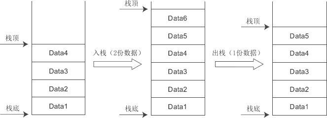
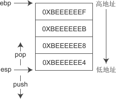

### 栈的概念

从本质上来讲，**栈是一段连续的内存**，需要同时记录栈底和栈顶，才能对当前的栈进行定位。在现代计算机中，通常使用ebp寄存器指向栈底，而使用esp寄存器指向栈顶。随着数据的进栈出栈，esp 的值会不断变化，进栈时 esp 的值减小，出栈时 esp 的值增大。
ebp 和 esp 都是CPU中的**寄存器**：ebp 是 Extend Base Pointer 的缩写，通常用来指向栈底；esp 是 Extend Stack Pointer 的缩写，通常用来指向栈顶。
如下图所示是一个栈的实例：

### 栈的大小和溢出

对每个程序来说，栈能使用的内存是有限的，一般是 1M~8M，这在编译时就已经决定了，程序运行期间不能再改变。如果程序使用的栈内存超出最大值，就会发生栈溢出（Stack Overflow）错误。

一个程序可以包含**多个线程**，**每个线程都有自己的栈**，严格来说，栈的最大值是针对线程来说的，而不是针对程序。

编译器会为栈内存指定一个最大值，在 VC/VS 下，默认是 1M，在 C-Free 下，默认是 2M，在 Linux GCC 下，默认是 8M。

**栈大小是可以修改的**

### 栈帧

当发生函数调用时，会将函数运行需要的信息全部压入栈中，这常常被称为栈帧（Stack Frame）或活动记录（Activate Record）。活动记录一般包括以下几个方面的内容：

1.  函数的返回地址，也就是函数执行完成后从哪里开始继续执行后面的代码。
2. 参数和局部变量。有些编译器，或者编译器在开启优化选项的情况下，会通过寄存器来传递参数，而不是将参数压入栈中，我们暂时不考虑这种情况。
3. 编译器自动生成的临时数据。例如，当函数返回值的长度较大（比如占用40个字节）时，会先将返回值压入栈中，然后再交给函数调用者。当返回值的长度较小（char、int、long 等）时，不会被压入栈中，而是先将返回值放入寄存器，再传递给函数调用者。
4. 一些需要保存的寄存器，例如 ebp、ebx、esi、edi 等。之所以要保存寄存器的值，是为了在函数退出时能够恢复到函数调用之前的场景，继续执行上层函数。