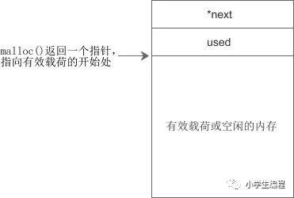
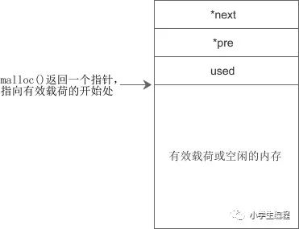

### 传统数组

1. 长度必须事先指定，不能是变量；
2. 运行中长度不能变化
3. 所占空间无法手动释放

### 动态内存

使用malloc分配，free释放。

```C
int *p = (int *)malloc(4);
```

当用 malloc 分配动态内存之后，上面这个指针变量 p 就被初始化了。

### 堆的分配算法

在程序运行过程中，堆内存从低地址向高地址连续分配，随着内存的释放，会出现不连续的空闲区域，如下图所示：

图1：已分配内存和空闲内存相间出现

带阴影的方框是已被分配的内存，白色方框是空闲内存或已被释放的内存。程序需要内存时，[malloc](https://so.csdn.net/so/search?q=malloc&spm=1001.2101.3001.7020)() 首先遍历空闲区域，看是否有大小合适的内存块，如果有，就分配，如果没有，就向操作系统申请(发生系统调用)。为了保证分配给程序的内存的连续性，malloc() 只会在一个空闲区域中分配，而不能将多个空闲区域联合起来。内存块(包括已分配和空闲的)的结构类似于链表，它们之间通过指针连接在一起。

在实际应用中，一个内存块的结构如下图所示：

图2：内存块的结构

next 是指针，指向下一个内存块，used 用来表示当前内存块是否已被使用。这样，整个堆区就会形成如下图所示的链表：

图3：类似链表的[内存管理](https://so.csdn.net/so/search?q=内存管理&spm=1001.2101.3001.7020)方式

现在假设需要为程序分配100个字节的内存，当搜索到图中第一个空闲区域(大小为200个字节)时，发现满足条件，那么就在这里分配。这时候 malloc() 会把第一个空闲区域拆分成两部分，一部分交给程序使用，剩下的部分任然空闲，如下图所示：

图4：为程序分配100个字节的内存

仍然以图3为例，当程序释放掉第三个内存块时，就会形成新的空闲区域，free() 会将第二、三、四个连续的空闲区域合并为一个，如下图所示：

图5：释放第三个内存块

可以看到，malloc() 和 free() 所做的工作主要是对已有内存块的分拆和合并，并没有频繁地向操作系统申请内存，这大大提高了内存分配的效率。另外，由于单向链表只能向一个方向搜索，在合并或拆分内存块时不方便，所以大部分 malloc() 实现都会在内存块中增加一个 pre 指针指向上一个内存块，构成双向链表，如下图所示：



链表是一种经典的堆内存管理方式，经常被用在教学中，很多C语言教程都会提到“栈内存的分配类似于数据结构中的栈，而堆内存的分配却类似于数据结构中的链表”就是源于此。链表式内存管理虽然思路简单，容易理解，但存在很多问题，例如：

- 一旦链表中的 pre 或 next 指针被破坏，整个堆就无法工作，而这些数据恰恰很容易被越界读写所接触到。
- 小的空闲区域往往不容易再次分配，形成很多内存碎片。
- 经常分配和释放内存会造成链表过长，增加遍历的时间。

针对链表的缺点，后来人们提出了位图和对象池的管理方式，而现在的 malloc() 往往采用多种方式复合而成，不同大小的内存块往往采用不同的措施，以保证内存分配的安全和效率。

C/C++程序经常会发生内存泄露，程序刚开始运行时占用内存很少，随着时间的推移，内存使用不断增加，导致整个计算机运行缓慢。内存泄露的问题往往难于调试和发现，或者只有在特定条件下才会复现，这给代码修改带来了不少障碍。为了提高程序的稳定性和健壮性，后来的 Java、Python、C#、JavaScript、PHP 等使用了虚拟机机制的非编译型语言都加入了垃圾内存自动回收机制，这样程序员就不需要管理内存了，系统会自动识别不再使用的内存并把它们释放掉，避免内存泄露。可以说，这些高级语言在底层都实现了自己的内存池，也即有自己的内存管理机制。