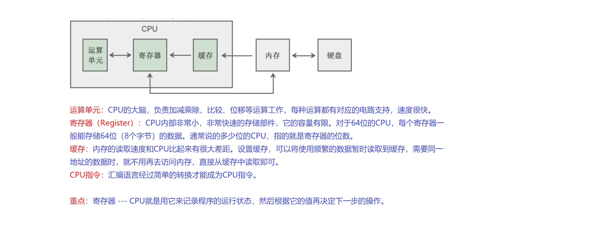

### CPU内存

cpu运行速率很快，内存的就很慢，所以就需要缓存，缓存分为一级二级三级，越往下优先级越低，成本越低，容量越大。

读写速率：寄存器>一级缓存>二级缓存

### 虚拟内存

程序中的内存地址是虚拟的，并不直接对应物理地址，而是需要经过操作系统映射到真实物理地址，并且这个真实地址可能会变（但虚拟地址不变）

优点

- 使不同程序之间的内存隔离开，避免冲突
- 提高内存使用效率；使用虚拟地址后，操作系统会更多地介入到内存管理工作中，这使得控制内存权限成为可能

### 内存模型（Linux）

#### 内核空间和用户空间

对于32位环境，理论上程序拥有4GB虚拟内存；

但是，在这 4GB 的地址空间中，要拿出一部分给操作系统内核使用，应用程序无法直接访问这一段内存，这一部分内存地址被称为内核空间（Kernel Space）；剩下的为用户空间。

#### Linux下32为用户空间内粗

对各个内存分区的说明：

| 内存分区                 | 说明                                                         |
| ------------------------ | ------------------------------------------------------------ |
| 程序代码区 (code)        | 存放函数体的二进制代码。一个C语言程序由多个函数构成，C语言程序的执行就是函数之间的相互调用。 |
| 常量区 (constant)        | 存放一般的常量、字符串常量等。这块内存只有读取权限，没有写入权限，因此它们的值在程序运行期间不能改变。 |
| 全局数据区 (global data) | 存放全局变量、静态变量等。这块内存有读写权限，因此它们的值在程序运行期间可以任意改变。 |
| 堆区 (heap)              | 一般由程序员分配和释放，若程序员不释放，程序运行结束时由操作系统回收。[malloc()](http://c.biancheng.net/cpp/html/137.html)、[calloc()](http://c.biancheng.net/cpp/html/134.html)、[free()](http://c.biancheng.net/cpp/html/135.html) 等函数操作的就是这块内存，这也是本章要讲解的重点。  注意：这里所说的堆区与数据结构中的堆不是一个概念，堆区的分配方式倒是类似于链表。C++中new和delete也是 |
| 动态链接库               | 用于在程序运行期间加载和卸载动态链接库。                     |
| 栈区 (stack)             | 存放函数的参数值、局部变量的值等，其操作方式类似于数据结构中的栈。 |

- 程序代码区用来保存指令
- 常量区、全局数据区、堆、栈都用来保存数据
- 程序代码区、常量区、全局数据区在程序加载到内存后就分配好了；只能等到程序运行结束后由操作系统收回
- 函数被调用时，会将参数、局部变量、返回地址等与函数相关的信息压入栈中，函数执行结束后，这些信息都将被销毁。
- 堆内存在程序主动释放之前会一直存在，不随函数的结束而失效。**在函数内部产生的数据只要放到堆中，就可以在函数外部使用**。

### 

### 对应关系

栈是在一级缓存里面的，堆是属于二级缓存，所以**栈的效率比堆的高**

