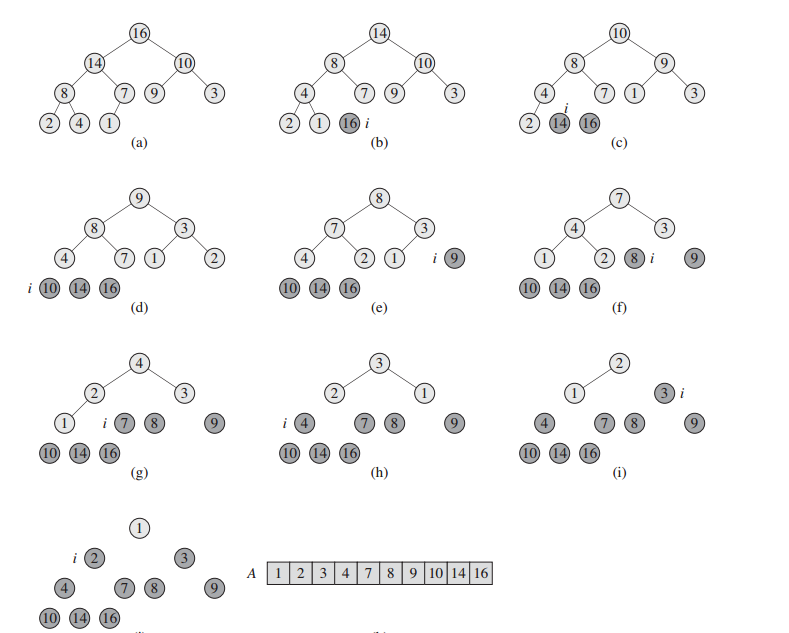

[TOC]


## 1. 堆排序（heapsort）
### 1.1 细节
结构为二叉树，可以分为最大堆和最小堆；  
最大堆中每一个子节点都**小于等于**父节点；  
最小堆中每一个子节点都**大于等于**父节点；  
时间复杂度和快速排序（qsort函数）一样，但慢一些；不过最坏情况仍然有$$O(NlogN)$$，


### 1.2 实现
1. 利用给定数组创建一个堆H[0..n-1]（我们这里使用最小堆），输出堆顶元素
2. 以最后一个元素代替堆顶，调整成堆，**输出堆顶元素**
3. 把堆的尺寸缩小1
4. 重复步骤2，直到堆的尺寸为1

```c++
#include <iostream>
#include <vector>
#include <time.h>
#include <Windows.h>

//辅助交换函数
void Swap(int &a, int &b)
{
	int temp = a;
	a = b;
	b = temp;
}

//堆排序的核心是建堆,传入参数为数组，根节点位置，数组长度
void Heap_build(int a[],int root,int length)
{
	int lchild = root*2+1;//根节点的左子结点下标
	if (lchild < length)//左子结点下标不能超出数组的长度
	{
		int flag = lchild;//flag保存左右节点中最大值的下标
		int rchild = lchild+1;//根节点的右子结点下标
		if (rchild < length)//右子结点下标不能超出数组的长度(如果有的话)
		{
			if (a[rchild] > a[flag])//找出左右子结点中的最大值
			{
				flag = rchild;
			}
		}
		if (a[root] < a[flag])
		{
			//交换父结点和比父结点大的最大子节点
			Swap(a[root],a[flag]);
			//从此次最大子节点的那个位置开始递归建堆
			Heap_build(a,flag,length);
		}
	}
}
// len is the length of input array;
// a/2 will throw the portion.
void Heap_sort(int a[],int len)
{
	// 这个for循环实现了第2步，下图的图a，建立了一个最大堆；
	for (int i = len/2; i >= 0; --i)//从最后一个非叶子节点的父结点开始建堆
	{
		Heap_build(a,i,len);
	}

	// 这里用for逐步输出每一个堆顶的值；注意，j表示元素数目，一直在减少。
	for (int j = len-1; j > 0; --j)//j表示数组此时的长度，因为len长度已经建过了，从len-1开始
	{
		Swap(a[0],a[j]);//交换首尾元素,将最大值交换到数组的最后位置保存
		Heap_build(a,0,j);//去除最后位置的元素重新建堆，此处j表示数组的长度，最后一个位置下标变为len-2
	}

}
```



### 1.3 实例（改进算法）
优先队列Priority_Queue


