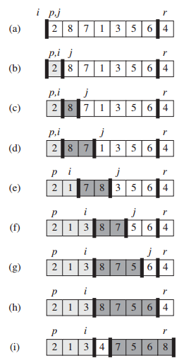

## 0. 快速排序（quick sort）
- 在STL中命名为qsort函数；
### 算法思想
数组分为左右两队，中间的值为`flag`，左边的数组全小于flag，右边的全大于flag；



注意图上的4个下标索引；
### 步骤
1. p为头，r为尾；j负责循环，i负责标记当前比较小的值；
2. j循环，当(a[j]<a[r])，exchange a[i] with a[j];
3. 循环结束，exchange a[i+1] with a[r]; 此时a[i+1]为`flag`;
4. 重复2；

```c++
#include<iostream>
using namespace std;
 

int partition(vector<int> &vi, int low, int up)
{
	int pivot = vi[up];
	int i = low-1;
	for (int j = low; j < up; j++)
	{
		if(vi[j] <= pivot)
		{
			i++;
			swap(vi[i], vi[j]);
		}
	}
	swap(vi[i+1], vi[up]);
	return i+1;

void quickSort(vector<int> &vi, int low, int up)
{
	if(low < up)
	{
		int mid = partition(vi, low, up);
		//Watch out! The mid position is on the place, so we don't need to consider it again.
		//That's why below is mid-1, not mid! Otherwise it will occur overflow error!!!
		quickSort(vi, low, mid-1);
		quickSort(vi, mid+1, up);
	}
}

void qSort(vector<int> &vi)
{
	quickSort(vi, 0, vi.size()-1);
}

int main()
{
	int a[10];
	for (int i = 0; i < 10; i++)
	{
		a[i] = rand() % 10;
		printf("%d ", a[i]);
	}
	printf("\n");
	quickSort(a, 0, 9);
	for (int i = 0; i < 10; i++)
	{
		printf("%d ", a[i]);
	}
	printf("\n");
	system("pause");
	return 0;
}
```

### 改进版本
随机化快速排序  
随机选取一个数组元素作为主元而不是a[r]；
