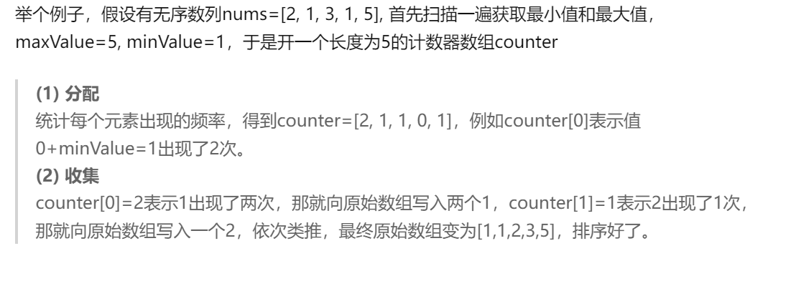
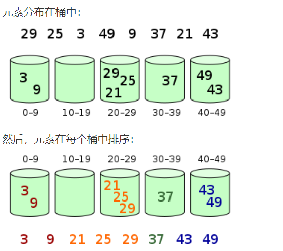
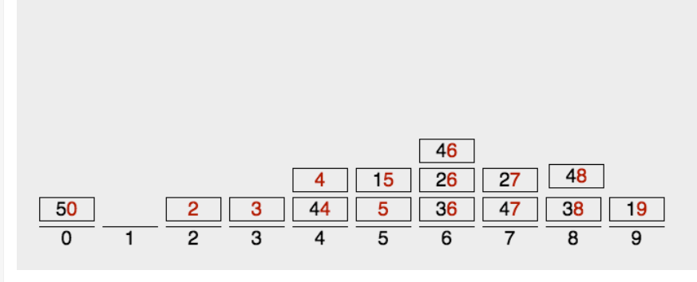
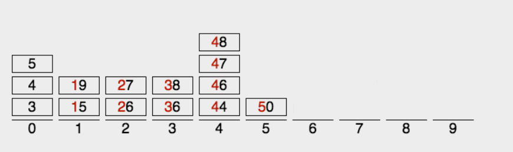

## Comparison

| 算法     | 最差运行时间  | 平均时间      |
| -------- | ------------- | ------------- |
| 插入排序 | $$O(n^2)$$    | $$O(n^2)$$    |
| 归并排序 | $$O(nlog n)$$ | $$O(nlog n)$$ |
| 堆排序   | $$O(nlog n)$$ | -             |
| 快速排序 | $$O( n^2 )$$  | $$O(nlog n)$$ |
| 计数排序 | $$O(k+n)$$    | $$O(k+n)$$    |
| 基数排序 | $$O(d(n+k))$$ | $$O(d(n+k))$$ |
| 桶排序   | $$O(n^2)$$    | $$O(n)$$      |

#### 0. 冒泡排序

两两对比并**交换顺序**（当大树在前时）；因为小数会慢慢浮到前面。

**好处在于无需额外空间**。

#### 1. 选择排序

先找到最小数，再在剩下数里找最小数；

也需要两两对比（但每轮循环会减少一个对比（已经找到最小了））但不交换顺序。

#### 2. 插入排序

构建有序序列，对于未排序数据，在已排序序列中从后向前扫描，找到相应位置并插入。

#### 3. 希尔排序

分区的插入排序；原理是插入排序在对几乎已经排好序的数据操作时，效率高，即可以达到线性排序的效率

先将整个待排序的记录序列按下标间隔分割成为若干子序列分别进行直接插入排序。如：例子 3 5 10 8 7 2 8 1 20 6；d=2 分成2组 （3 10 7 8 20） 和（5 8 2 1 6）；间隔为2。

#### 4. 归并排序

分治思想（递归分割）

#### 5. 快速排序

分冶思想，选一个基准值（比归并多的东西。一般基准取第一个数字），然后把序列分两组（左边都小，右边都大）

#### 6. 堆排序

利用二叉树特性，最大（或最小）值放到根节点；

#### 7. 计数排序

空间换时间

**只对整数有效；空间也有浪费**；

#### 8. 桶排序

分区的计数排序

#### 9. 基数排序

将整数按位数切割成不同的数字，然后按每个位数分别比较（从低位到高位）

这三种排序算法都利用了桶的概念，但对桶的使用方法上有明显差异：

- 基数排序：根据键值的每位数字来分配桶；
- 计数排序：每个桶只存储单一键值；
- 桶排序：每个桶存储一定范围的数值；

三种的区别在于对桶利用的效率

### 复杂度计算

最好情况：已排序的序列

最坏情况：逆序的序列；

#### 平均情况：

1. 排序方法，都有一个共同点，就是每次从最小的序列开始排序；所以每轮只能消除一个逆序。要计算平均复杂度，只需要知道数组平均有多少逆序就行。对于N个互异数字的数组L，两两组合一共有N(N-1)种组合，这些组合有逆序也有正序。我们创造L的反序Lr，那么Lr数组中的逆序 = L数组的正序数量。于是这两个数组一共有N(N-1)*2个序列，其中一半是逆序，也就是N(N-1)/2（？）。因此可证明平均每个数组的逆序数量是N(N-1)/4。
2. 如果有一个长为N的序列L，那么总共有N!种排列。这些排列中只有一种是有序的。将所有排列组成一个决策树，由于比较只有两种可能(>= <,> <= >都是两种)所以这是一个二叉树。所有的排列都在叶子节点上，一共有N！个叶子节点。那么我们的决策树平均深度至少就是log(N!)。我们的算法就需要至少log(N!)次判断才能得出结果。
   计算log(N!)，最后结果是 N/2*logN - N/2。也就是O(NlogN)

#### 稳定性

**`稳定`**的算法在排序的过程中不会改变元素彼此的位置的相对次序，反之**`不稳定`**的排序算法经常会改变这个次序,这是我们不愿意看到的。