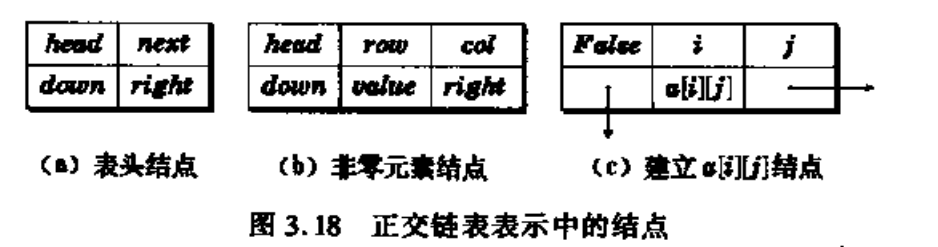

## 1. 表

  

### 新建链表结构

```C++
struct list_node {
    int val;
    list_node *next;
    list_node(int x) : val(x), next(nullptr) { }
};
```

### 插入

#### 头插入

头插入的难点在于如何让传入的头指针一直指向头结点。

```C++
//头指针不变，吧新结点变为第二个节点，未完全达到目标
void add_front_node(list_node* a, int val)
{
    list_node* t = new list_node(val);
    t->next = a->next;
    a->next = t;
}
```

真正达到目标的方法

```C++
void add_front_node(list_node** a, int val)
{
    list_node* t = new list_node(val);
    t->next = *a;
    *a = t;//把新头指针作为*a；
}
```

解析：传入的a是头结点的地址；**是二级指针，即指向指针的指针；这样最后一行就改变了一级指针，但二级指针没受影响，规避了形参不变的问题。

#### 尾插入

```C++
void add_back_node(list_node* a, int val)
{
    while(a->next != nullptr) a = a->next;//需要循环到最后一个结点；
    a->next = new list_node(val);
}
```

#### 逆转

```C++
list_node *reverse_node(list_node *a)
{
    list_node *ppre, *pcur, *pnext;
    ppre = a;
    pcur = a->next;
    while(pcur != nullptr)
    {
        pnext = pcur->next;
        pcur->next = ppre;
        ppre = pcur;
        pcur = pnext;
    }

    a->next = nullptr;//避免陷入循环；
    a = ppre;//局部变量会被销毁。
    return a;//注意实参指针a也已经改变了
}
```


### STL中

#### vector

在常量时间内是可索引的，但插入新项或删除已有的项代价是昂贵的。

#### List（双向）

与上图所示一样，插入和删除很容易，但是索引很难；

此外，两者的查找效率都很低

#### 栈

先进后出

#### 队列

先进先出

## 多项式

与顺序方式表示相比：  
1. 链表方便表示不定项的多项式，
2. 对于某些零系数项，执行加法运算后不再是零系数，此时需要增加新的项；
3. 对于非零项，加法后可能是零项，需要删除。

## 稀疏矩阵
使用顺序表，在矩阵运算时容易出现新项或需要消去零项，因此不太适合；  
正交链表结构更方便；  



## stl中vector与list的异同

list是双向链表

#### 相同点

- 都能在常量时间内在末尾添加/删除对象
- 子啊常量时间内访问表前/后端的项

#### list优势

- 前端高效添加/删除（vector要重新复制移动所有对象）

#### vector优势

- 随机（索引）访问