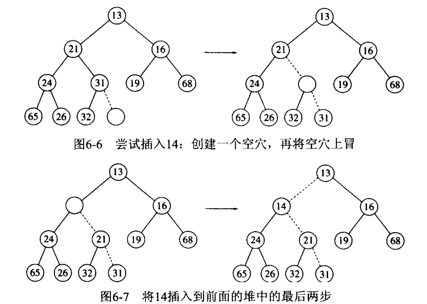
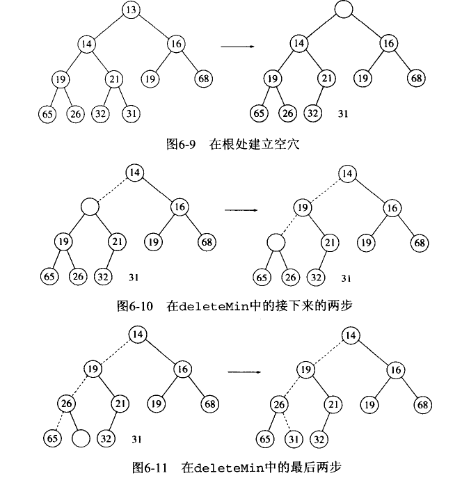

#### 一些现实需求

比如队列中有些**短的任务**可以优先处理。

堆，也被称为优先队列，是按优先级来进行排序的，优先级可以按照大小来规定。完全二叉树只是堆的一种实现方式。而完全二叉树又由于父节点和子节点下标的数量关系而方便地用数组来存储value。

主要两种操作：insert和deleteMin，找出返回和删除优先队列中**最小元素**

这里主要讲述优先队列如何实现。  

## 一些简单实现
1. 以**简单链表**形式，插入只需O(1)时间，并比哪里删除最小元素，这需要O(N)时间；  
2. 始终让表处于排序状态，则插入代价是O(N)，而删除最小元素是O(1)
3. 二叉查找树，插入与删除平均时间都是O(log N)

## 二叉堆
### 结构特性
堆是一棵被完全填满的二叉树；即完全二叉树。完全二叉树很有规律，所以可以用数组表示而不需要使用链表；


对于任一位置i，其左儿子在2i位置，右儿子在2i+1上。

### 堆序性质

使操作可以快速执行的性质。**比如令结点X的父结点的键小于或等于X**。（注意这与二叉查找树不一样）。

### 基本操作
#### insert

- 先插入空穴，保证二叉堆的完整
- 与父节点比较，并交换位置。（由于父节点一定最小）



```c++
void insert(const Comparable & x)// 这里用的引用，因为是用数组来表示？
{
    if(currentSize == array.size()-1)//currentsize是指i位置？，二叉堆干好满了
        array.resize(array.size()*2);//插入要增加一层
    int hole = ++currentSize;//新结点的位置
    for(; hole>1&&x<array[hole/2];hole/=2)//hole=1是终止条件，插入值x是否小于父节点
        array[hole] = array[hole/2];//父节点下移
    array[hole]=x;//找到位置并插入
}
```

理论上，可以反复使用交换来实现，但一条交换需要3条语句，d层需要3d条，而这里只需要d+1条。

#### deleteMin（困难）

- 找到很简单，就是根节点
- 删除：先把最后一个结点移开
- 对比根节点的左右儿子，较小者移入
- 重复上一步
- 把最后一个结点移入空穴



```c++
void deleteMin()//单纯删除
{
    if(isEmpty())
        throw UnderflowException();
    array[1] = array[currentSize--];//后置--返回的是当前值，并减一;把最后一个结点放入root
    percolateDown(1);    
}

void deletaMin(Comparable &minItem)//删除并且保留最小值
{
    if(isEmpty())
        throw UnderflowException();
    minItem = array[1];
    array[1] = array[currentSize--];//后置--返回的是当前值，并减一
    percolateDown(1);    
}

void percolateDown(int hole)
{
    int child;
    Comparable tmp = array[hole];
    for(; hole*2<=currentSize; hole=child)
    {
        child = hole*2;
        if(child != currentSize && array[child+1]<array[child])
            child++;
        if(array[child]<tmp)
            array[hold] = array[child];
        else
            break;
    }
    array[hole] = tmp;
}
```


#### 其他操作

堆中关于**序**的信息很少，可以考虑用散列函数。

## 优先队列的应用

### 选择问题

考虑有N个整数，要找出第k大的值

#### 算法6A

我们这里考虑只找出第k个最小元素。

- 先将N个数读入数组，再对数组应用建堆；醉花情形是O(N)
- 执行k次deleteMin操作，再提取出元素即可；每次执行s是O(logN)，因此运行时间是$O(N+k\log N)$

注意，如果令k=N，运行该程序并在元素离开堆时记录路元素值，那实际上就是以时间O(NlogN)进行了排序，即**堆排序**。

#### 算法6B

建立一个维持k个最大元素的集合S

- 当前k个元素读入后，每增加一个新元素，该元素与第k大元素比较，假设为$S_k$，注意$S_k$时S中最小元素。

- 如果新元素更大，那么用其代替$S_k$。

- 输入完成时，S中最小的元素即是

这一前一个算法基本一致，但这里用一个堆实现S


