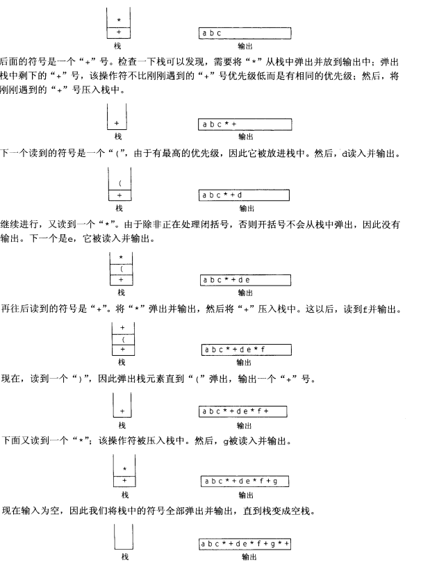

## 栈的实现
**栈本质上就是一个表**，STL中的list和vector都支持栈操作；两个比较流行的栈的实现时链接和数组。

#### 链接：
单项链表，只在表顶端插入元素和删除来实现push和pop
#### 数组
使用vector中的back、pop_back和push_back
## 栈的应用
#### 1. 检验是否缺少符号
算法：做一个空栈，读取字符直到文件尾，读取时若字符时开放符号，则压入栈中。  
如果字符是一个封闭符号，且栈为空，则报错；  
若栈不为空，则将栈中的元素弹出。如果弹出的不是对应的开放符号，报错。  
如果到了文件尾栈还是非空，则报错
#### 2. 后缀表达式
需要很高的设计技巧。   

要计算$$4.99*1.06+5.99+6.99*1.06$$，可以利用栈的特性，输入：  
$$4.99, 1.06, *, 5.99, +, 6.99, +, 1.06, *, +$$  
这种叫做后最postfix或逆波兰记法。处理过程是：如果输入一个数，则压入栈中，如果输入操作符，则把栈中的数弹出并操作，将结果压入栈中，后面同样
#### 3. 中缀到后缀的转换
要把中缀$$a+b*c+(d*e+f)*g$$转换到后缀$$abc*+de*f+g*+$$  

过程：
1. 读到一个数字时，放入输出；读到操作符时，存入栈，遇到左圆括号时也放入栈中；  
2. 如果遇到的操作符比栈顶的优先更高，存入栈中；如果更低，将栈顶操作符弹出到输出中；
3. 约到右括号，弹出到左括号的全部操作符（注意，这里可以丢弃括号）；
4. 输入为空，弹出栈中所有操作符。

#### 函数调用：
当一个新函数被调用时，需要把原来主调例程中的局部变量存储起来；  
或者时递归调用的时候。

缺点：每个函数都要占用一定的内存，如果栈很高，就意味着计算机存储了大量函数调用的信息。可能需要占用大量的内存。