# 树

## 二叉树

结点不多于两个儿子；
平均深度为$$\sqrt N$$，

二叉树的存储：  

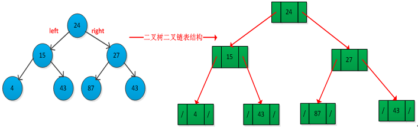

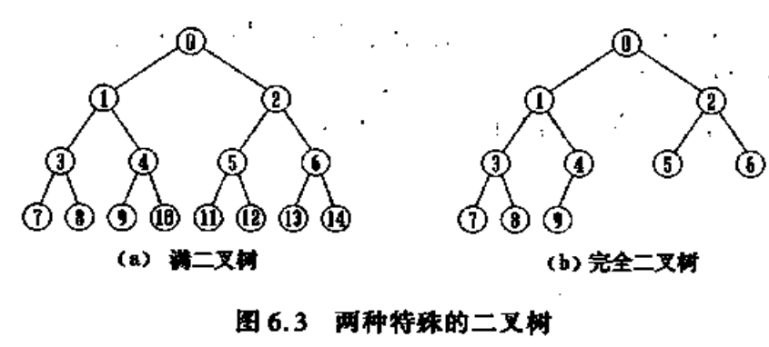

### 二叉树的表示

#### 1. 数组表示

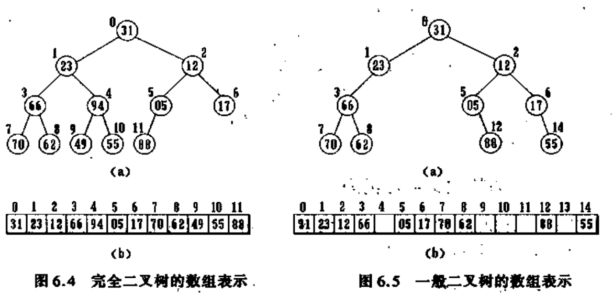

数组对满二叉树的表示非常有效，但对一般二叉树的表示会造成极大的浪费。  

#### 2. 链表

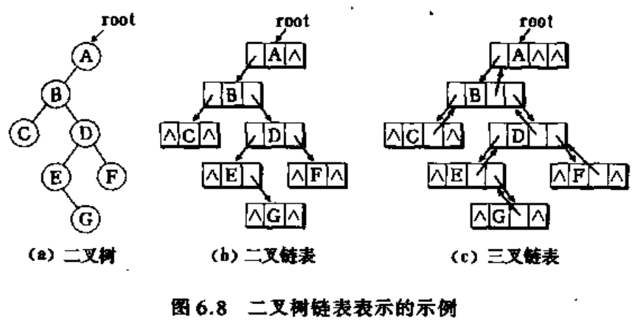

### 遍历

假定左右等价，这里只考虑先左后右

#### 中序遍历（LVR）
如：表达式树：树叶都是操作数，而其他父结点都是操作符。  

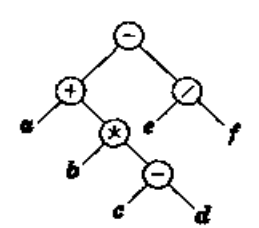

$$a+b*(c-d)-e/f$$

#### 前序遍历（VLR）

$$-+a*b-cd/ef$$  

先对结点处理，再对儿结点处理；

#### 后序遍历（LRV）

$$abcd-*+ef/-$$

可以用于计算节点个数或者二叉树高度（depth）

### 二叉查找树
左结点**所有值**<父结点所有值<右结点所有值；二分查找发的时间复杂度是$$O(lof N)$$，不用担心栈空间被用完；  
在二叉查找树中，数据可以是一个复杂类型（比如类？，包含雇员编号，姓名等），然后通过重载操作符<实现查找和比较。

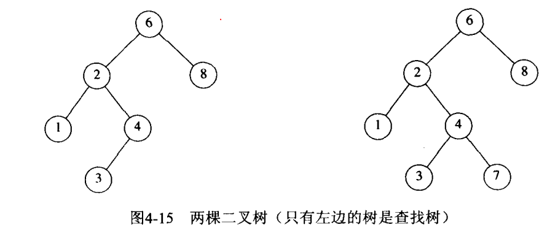

#### contains
函数功能：如果树T中由项位x的结点，contains返回true，否则返回false，  
当T为空，也返回false，如果存在，返回true；如果两种情况都不存在，则对子树进行**递归调用**；比较X与shuT中的项的大小，决定往左子树还是右子树递归。  
**注意：为保证稳健性，需要先测试树是否为空**。  

**Tips：**  
递归可以用while循环实现；  
```C++
// 使用递归实现findMin
BinaryNode *findMin(BinaryNode *t) const
{
    if(t==NULL)
    	return NULL;
    if(t->right==NULL)
    	return t;
    return findMin(t->left);    
}

// 使用while实现findMax
BinaryNode *findMax(BinaryNode *t) const
{
    if(t!=NULL)
    	while(t->right!=NULL)
    	//注意这里对t的改变是安全的，因为我们只用指针的副本来工作，但还是要小心；
    	//比图t->right=t->right->right这样的语句会产生一些变化。
    		t=t->right;
    return
}
```
#### insert

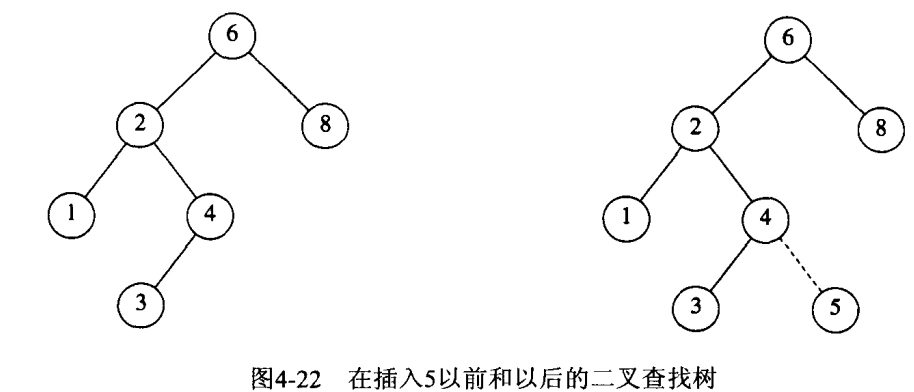

重复元的插入比较复杂：可以通过在结点记录中保留一个附加字段以指示此数据元出现的频率；  
但是，如果重载了操作符<，可能就行不通。此时可以把具有相同键的所有结构保留在一个辅助数据结构中，如表或者另一颗查找树。
#### remove
只有一个儿结点

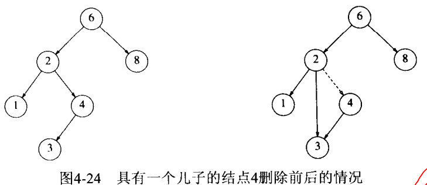

两个儿结点：  

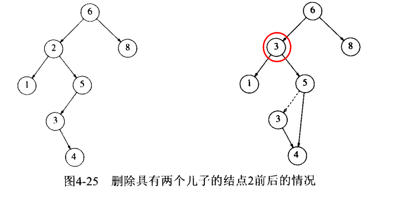

先用右子树中最小的数据代替要删除的几点数据，并递归地删除那个结点。  
**懒惰删除lazy deletion**：北山乡仍然留在树中，但做了一个被删除的记号。


### AVL树
- 一种带有平衡条件的二叉查找树；
- 保证深度为O（log N）；

一棵AVL树是每个结点的左子树和右子树的高度最多差1的二叉查找树（空树的高度定义为1）。

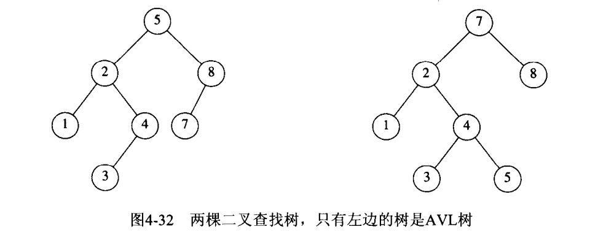

#### 旋转
插入操作可能会破坏AVL的平衡条件，所以需要**旋转**；可能的情况为：  
1. A结点的左（右）儿子的左（右）子树进行一次插入；这种情况需要**单旋转**；
2. A结点的左（右）儿子的右（左）子树进行一次插入；这种情况需要**双旋转**；
#### 单旋转
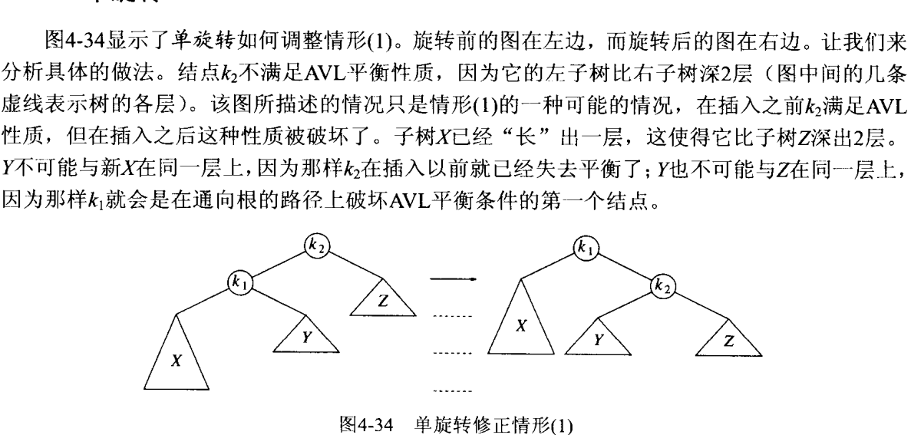

对X左旋意味着要把X变成左子树；

#### 双旋转

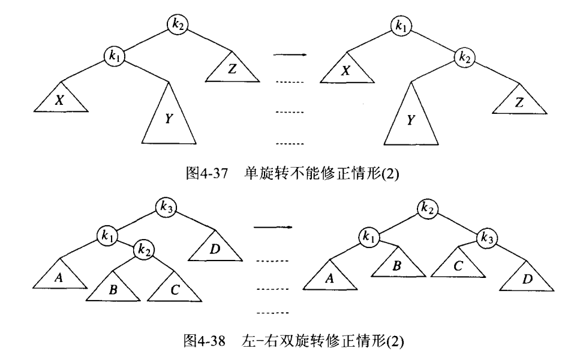

## 红黑树
AVL树的一个变种，最坏情况下操作花费$$O(log N)$$；  
#### 特征
1. 每个结点要么红色，要么黑色
2. 根是黑色
3. 如果一个结点是红色，那么子结点必须黑色
4. 从一个结点到一个NULL指针的每一条路径都必须包含相同数目的黑色结点。


该规则的结论是：红黑树的高度最多$$2log(N+1)$$。
#### 插入
1. 红黑树本身是一棵二叉查找树，将结点插入后，它仍然是二叉查找树。
2. 将插入的结点着色为“红色”，这样不会违背特征4，
3. 一系列旋转，使之成为红黑树；
## 伸展树
在伸展树上的一般操作都基于伸展操作：假设想要对一个二叉查找树执行一系列的查找操作，为了使整个查找时间更小，被查频率高的那些条目就应当经常处于靠近树根的位置。于是想到设计一个简单方法，在每次查找之后对树进行調整，把被查找的条目搬移到离树根近一些的地方。伸展树应运而生。伸展树是一种自调整形式的二叉查找树，它会沿着从某个节点到树根之间的路径，通过一系列的旋转把这个节点搬移到树根去。
## 遍历
1. 前序遍历
2. 后序遍历
3. 中序遍历
4. 层序遍历：深度为d的点要在深度为d+1的结点之前处理。它不是递归地（递归默认用栈）实现，而是用队列。

## B树
应对需要存储要硬盘中的场景。  
B树保证只有少量的磁盘访问。  
### M阶树结构特性
1. 数据项存储再树叶上
2. 非叶结点存储直到M-1个键，以示搜索方向；键i表示子树i+1中最小的键
3. 3
4. 除了根意外，所有非叶结点的儿子数在M/2或M之间
5. 所有叶在统统深度上右L/2到L之间个数据；

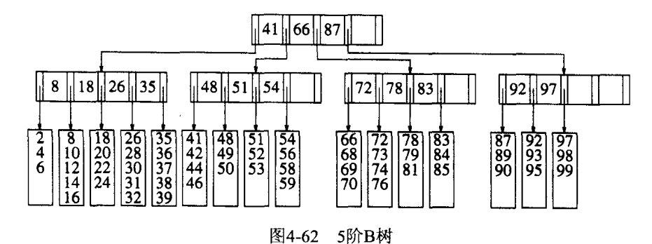

## STL中的set和map
用红黑树实现的；保证了基本操作（插入、查找、删除）是对数时间开销；  
### set
一个排序后的容器，不允许重复；  
#### insert
因为不允许重复，插入有可能会失败，所以insert返回了yigeiterator给出insert返回时的位置；这个iterator或指向新插入的项，或指向导致insert失败的项（可以用于删除，而不用查找）；
#### pair类模板

### map
存储由键和值组成的项的集合；键必须是唯一的。

### set和map的实现
底层实现是平衡二叉查找树，一般使用自顶向下红黑树。