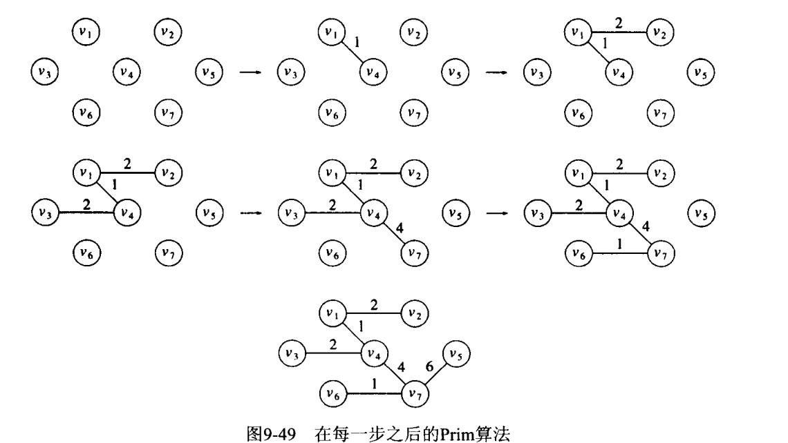
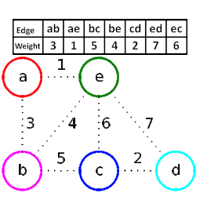

## 最小生成树
在一个无向图G中找到一个最小路径的树。  
**最小生成树存在当且仅当G是连通的**  


#### Prim算法
采用了贪心算法的思想。对于包含 N 个顶点的连通网，普里姆算法每次从连通网中找出一个权值最小的边，这样的操作重复 N-1 次，由 N-1 条权值最小的边组成的生成树就是最小生成树。

普里姆算法的实现思路是：

1. 将连通网中的所有顶点分为两类（假设为 A 类和 B 类）。初始状态下，所有顶点位于 B 类；
2. 选择任意一个顶点，将其从 B 类移动到 A 类；
3. 从 B 类的所有顶点出发，找出一条连接着 A 类中的某个顶点且权值最小的边，将此边连接着的 A 类中的顶点移动到 B 类；
4. 重复执行第 3 步，直至 B 类中的所有顶点全部移动到 A 类，恰好可以找到 N-1 条边。


图1已知每条边的权重



关键实现：

- 寻找已访问顶点（A类）邻接的权值最小的顶点
- 更新已访问顶点（A类）邻接的所有权重

```C
#include<stdio.h>
#define V 6    // 记录图中顶点的个数
typedef enum { false, true } bool;
//查找权值最小的、尚未被选择的顶点，key 数组记录了各顶点之间的权值数据，visited数组记录着各个顶点是否已经被选择的信息
int min_Key(int key[], bool visited[])
{
    int min = 2147483647, min_index;  //遍历 key 数组使用，min 记录最小的权值，min_index 记录最小权值关联的顶点
    //遍历 key 数组
    for (int v = 0; v < V; v++) {
        //如果当前顶点为被选择，且对应的权值小于 min 值
        if (visited[v] == false && key[v] < min) {
            //更新  min 的值并记录该顶点的位置
            min = key[v];
            min_index = v;
        }
    }
    //返回最小权值的顶点的位置
    return min_index;
}
//输出最小生成树
void print_MST(int parent[], int cost[V][V])
{
    int minCost = 0;
    printf("最小生成树为：\n");
    //遍历 parent 数组
    for (int i = 1; i < V; i++) {
        //parent 数组下标值表示各个顶点，各个下标对应的值为该顶点的父节点
        printf("%d - %d wight:%d\n", parent[i] + 1, i + 1, cost[i][parent[i]]);//由于数组下标从 0 开始，因此输出时各自 +1
        //统计最小生成树的总权值
        minCost += cost[i][parent[i]];
    }
    printf("总权值为：%d", minCost);
}
//根据用户提供了图的信息（存储在 cost 数组中），寻找最小生成树
void find_MST(int cost[V][V])
{    //key 数组用于记录 B 类顶点到 A 类顶点的权值
    //parent 数组用于记录最小生成树中各个顶点父节点的位置，便于最终生成最小生成树
    //visited 数组用于记录各个顶点属于 A 类还是 B 类
    int parent[V], key[V];
    bool visited[V];
    // 初始化 3 个数组
    for (int i = 0; i < V; i++) {
        key[i] = 2147483647;    // 将 key 数组各个位置设置为无限大的数
        visited[i] = false;     // 所有的顶点全部属于 B 类
        parent[i] = -1;         // 所有顶点都没有父节点
    }
    // 选择 key 数组中第一个顶点，开始寻找最小生成树
    key[0] = 0;  // 该顶点对应的权值设为 0
    parent[0] = -1; // 该顶点没有父节点
    // 对于 V 个顶点的图，最需选择 V-1 条路径，即可构成最小生成树
    // 这里是寻找A类（访问过）顶点附近权值更小的顶点。
    for (int x = 0; x < V - 1; x++)
    {
        // 从 key 数组中找到权值最小的顶点所在的位置
        int u = min_Key(key, visited);
        // 该顶点划分到 A 类
        visited[u] = true;
        // 由于新顶点加入 A 类，因此需要更新 key 数组中的数据，为下一次寻找做准备
        for (int v = 0; v < V; v++)
        {
            // 如果类 B 中存在到下标为 u 的顶点的权值比 key 数组中记录的权值还小，表明新顶点的加入，使得类 B 到类 A 顶点的权值有了更好的选择
            if (cost[u][v] != 0 && visited[v] == false && cost[u][v] < key[v])
            {
                // 更新 parent 数组记录的各个顶点父节点的信息
                parent[v] = u;
                // 更新 key 数组
                key[v] = cost[u][v];
            }
        }
    }
    //根据 parent 记录的各个顶点父节点的信息，输出寻找到的最小生成树
    print_MST(parent, cost);
}
// main function
int main()
{
    int p1, p2;
    int wight;
    int cost[V][V] = { 0 };
    printf("输入图（顶点到顶点的路径和权值)：\n");
    while (1) {
        scanf("%d %d", &p1, &p2);
        //如果用户输入 -1 -1，表示输入结束
        if (p1 == -1 && p2 == -1) {
            break;
        }
        scanf("%d", &wight);
        cost[p1 - 1][p2 - 1] = wight;
        cost[p2 - 1][p1 - 1] = wight;
    }
    // 根据用户输入的图的信息，寻找最小生成树
    find_MST(cost);
    return 0;
}
```


#### kruskal算法

贪心策略，连续（并行地）按照最小权值选边，（判定）顶不构成回路时就把它作为选取的边。有余要判定回路，复杂度较高。



关键实现：

- 权值排序
- 判断回路：这里教大家一种判断的方法：初始状态下，为连通网中的各个顶点配置不同的标记。对于一个新边，如果它两端顶点的标记不同（所有边是否相邻），就不会构成环路，可以组成最小生成树。一旦新边被选择，需要将它的两个顶点以及和它直接相连的所有已选边两端的顶点改为相同的标记；反之，如果新边两端顶点的标记相同，就表示会构成环路。

```C
#include <stdio.h>
#include <stdlib.h>
#define N 9   // 图中边的数量
#define P 6   // 图中顶点的数量
//构建表示边的结构体
struct edge {
    //一条边有 2 个顶点
    int initial;
    int end;
    //边的权值
    int weight;
};
//qsort排序函数中使用，使edges结构体中的边按照权值大小升序排序
int cmp(const void* a, const void* b) {
    return  ((struct edge*)a)->weight - ((struct edge*)b)->weight;
}
//克鲁斯卡尔算法寻找最小生成树，edges 存储用户输入的图的各个边，minTree 用于记录组成最小生成树的各个边
void kruskal_MinTree(struct edge edges[], struct edge minTree[]) {
    int i, initial, end, elem, k;
    //每个顶点配置一个标记值
    int assists[P];
    int num = 0;
    //初始状态下，每个顶点的标记都不相同
    for (i = 0; i < P; i++) {
        assists[i] = i;
    }
    //根据权值，对所有边进行升序排序
    qsort(edges, N, sizeof(edges[0]), cmp);
    //遍历所有的边
    for (i = 0; i < N; i++) {
        //找到当前边的两个顶点在 assists 数组中的位置下标
        initial = edges[i].initial - 1;
        end = edges[i].end - 1;
        //如果顶点位置存在且顶点的标记不同，说明不在一个集合中，不会产生回路
        if (assists[initial] != assists[end]) {
            //记录该边，作为最小生成树的组成部分
            minTree[num] = edges[i];
            //计数+1
            num++;
            elem = assists[end];
            //将新加入生成树的顶点标记全部改为一样的
            for (k = 0; k < P; k++) {
                if (assists[k] == elem) {
                    assists[k] = assists[initial];
                }
            }
            //如果选择的边的数量和顶点数相差1，证明最小生成树已经形成，退出循环
            if (num == P - 1) {
                break;
            }
        }
    }
}
void display(struct edge minTree[]) {
    int cost = 0, i;
    printf("最小生成树为:\n");
    for (i = 0; i < P - 1; i++) {
        printf("%d-%d  权值：%d\n", minTree[i].initial, minTree[i].end, minTree[i].weight);
        cost += minTree[i].weight;
    }
    printf("总权值为：%d", cost);
}
int main() {
    int i;
    struct edge edges[N], minTree[P - 1];
    for (i = 0; i < N; i++) {
        scanf("%d %d %d", &edges[i].initial, &edges[i].end, &edges[i].weight);
    }
    kruskal_MinTree(edges, minTree);
    display(minTree);
    return 0;
}
```


### 两者对比

类似与Dijkstra算法  

两者的区别在于，每次更新路径的不一样

prim更新的是未标记集合到**已标记集合**之间的距离

Dijkstra更新的是**源点**到未标记集合之间的距离

**与Kruskal算法的区别**

Kruskal算法在加边的过程中，维护的不一定是一棵树（维护的是森林），而Prim算法始终是一棵树的延展

参考：[prim算法（普里姆算法）详解 (biancheng.net)](http://c.biancheng.net/algorithm/prim.html)