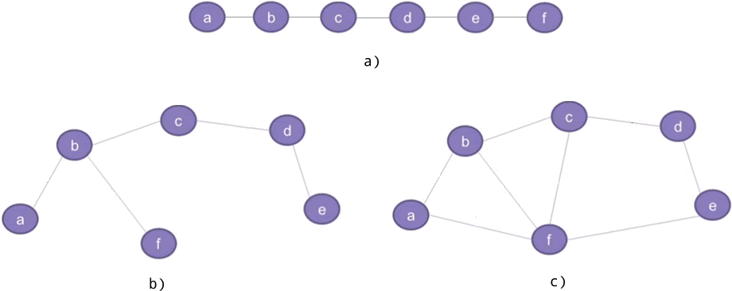
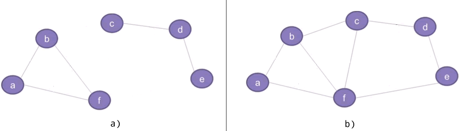

### 图结构

上图三种结构：a）线性表、b）树、c）图。

树和图的区别在于树储存中不允许环路，而图可以有。

### 生成树

根据顶点之间是否存在通路，图可以分为**连通图**和**非连通图**。

所谓生成树，指的是具备以下条件的连通图：

- 包含图中所有的顶点；
- 任意顶点之间有且仅有一条通路。

生成树有很多种

### 最小生成树

我们将 6 座城市分别用 a~f 表示，6 座城市之间可以修建的公路以及所需资金如下图所示：

图 4 城市道路模拟图

> a~f 这 6 个顶点各自代表一座城市，连接两个顶点的边代表两座城市之间可以修建公路，每条边对应的数值称为权，表示修建公路所需要的资金。

最小生成树指的就是在连通网中找到的总权值最小的生成树。在连通图查找最小生成树，常用的算法有两种，分别称为[普里姆算法](http://c.biancheng.net/algorithm/prim.html)和[克鲁斯卡尔算法](http://c.biancheng.net/algorithm/kruskal.html)