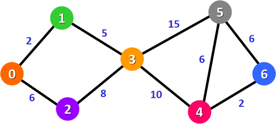

### 有权最短路径

#### Dijkstra(迪杰斯特拉)算法

单源最短路径算法；  
特点：贪心策略，有向图，带权（**无负权**）；  



假设查找顶点0到其他顶点的路径。

关键在于维持一个表

) 统计从顶点 0 直达其它顶点的权值，如下表所示：


|        | 1    | 2    | 3    | 4    | 5    | 6    |
| ------ | ---- | ---- | ---- | ---- | ---- | ---- |
| 总权值 | 2    | 6    | ∞    | ∞    | ∞    | ∞    |
| 路径   | 0-1  | 0-2  | 0-3  | 0-4  | 0-5  | 0-6  |

由此借助迪杰斯特拉算法，我们找出了顶点 0 到其它所有顶点的最短路径，如下表所示：


|        | 1     | 2     | 3     | 4       | 5       | 6         |
| ------ | ----- | ----- | ----- | ------- | ------- | --------- |
| 总权值 | **2** | **6** | **7** | **17**  | **22**  | **19**    |
| 路径   | 0-1   | 0-2   | 0-1-3 | 0-1-3-4 | 0-1-3-5 | 0-1-3-4-6 |

```C
#include <stdio.h>
#define V 20                   //顶点的最大个数
#define INFINITY 65535
typedef struct {
    int vexs[V];         //存储图中顶点数据
    int arcs[V][V];      //二维数组，记录顶点之间的关系
    int vexnum, arcnum;  //记录图的顶点数和弧（边）数
}MGraph;
//根据顶点本身数据，判断出顶点在二维数组中的位置
int LocateVex(MGraph * G, int v) {
    int i = 0;
    //遍历一维数组，找到变量v
    for (; i < G->vexnum; i++) {
        if (G->vexs[i] == v) {
            break;
        }
    }
    //如果找不到，输出提示语句，返回-1
    if (i > G->vexnum) {
        printf("no such vertex.\n");
        return -1;
    }
    return i;
}
//构造无向有权图
void CreateDG(MGraph *G) {
    printf("输入图的顶点数和边数：");
    scanf("%d %d", &(G->vexnum), &(G->arcnum));
    printf("输入各个顶点：");
    for (int i = 0; i < G->vexnum; i++) {
        scanf("%d", &(G->vexs[i]));
    }
    for (int i = 0; i < G->vexnum; i++) {
        for (int j = 0; j < G->vexnum; j++) {
            G->arcs[i][j] = INFINITY;
        }
    }
    printf("输入各个边的数据：\n");
    for (int i = 0; i < G->arcnum; i++) {
        int v1, v2, w;
        scanf("%d %d %d", &v1, &v2, &w);
        int n = LocateVex(G, v1);
        int m = LocateVex(G, v2);
        if (m == -1 || n == -1) {
            return;
        }
        G->arcs[n][m] = w;
        G->arcs[m][n] = w;
    }
}
//迪杰斯特拉算法，v0表示有向网中起始点所在数组中的下标
void Dijkstra_minTree(MGraph G, int v0, int p[V], int D[V]) {
    int final[V];//为各个顶点配置一个标记值，用于确认该顶点是否已经找到最短路径
    //对各数组进行初始化
    for (int v = 0; v < G.vexnum; v++) {
        final[v] = 0;
        D[v] = G.arcs[v0][v];
        p[v] = 0;
    }
    //由于以v0位下标的顶点为起始点，所以不用再判断
    D[v0] = 0;
    final[v0] = 1;
    int k = 0;
    for (int i = 0; i < G.vexnum; i++) {
        int min = INFINITY;
        //选择到各顶点权值最小的顶点，即为本次能确定最短路径的顶点
        for (int w = 0; w < G.vexnum; w++) {
            if (!final[w]) {
                if (D[w] < min) {
                    k = w;
                    min = D[w];
                }
            }
        }
        //设置该顶点的标志位为1，避免下次重复判断
        final[k] = 1;
        //对v0到各顶点的权值进行更新
        for (int w = 0; w < G.vexnum; w++) {
            if (!final[w] && (min + G.arcs[k][w] < D[w])) {
                D[w] = min + G.arcs[k][w];
                p[w] = k;//记录各个最短路径上存在的顶点
            }
        }
    }
}
int main() {
    MGraph G;
    CreateDG(&G);
    int P[V] = { 0 };   // 记录顶点 0 到各个顶点的最短的路径
    int D[V] = { 0 };   // 记录顶点 0 到各个顶点的总权值
    Dijkstra_minTree(G, 0, P, D);
  
    printf("最短路径为：\n");
    for (int i = 1; i < G.vexnum; i++) {
        printf("%d - %d的最短路径中的顶点有：", i, 0);
        printf(" %d-", i);
        int j = i;
        //由于每一段最短路径上都记录着经过的顶点，所以采用嵌套的方式输出即可得到各个最短路径上的所有顶点
        while (P[j] != 0) {
            printf("%d-", P[j]);
            j = P[j];
        }
        printf("0\n");
    }
    printf("源点到各顶点的最短路径长度为:\n");
    for (int i = 1; i < G.vexnum; i++) {
        printf("%d - %d : %d \n", G.vexs[0], G.vexs[i], D[i]);
    }
    return 0;
}
```


参考：[迪杰斯特拉算法（求最短路径） (biancheng.net)](http://c.biancheng.net/algorithm/dijkstra.html)