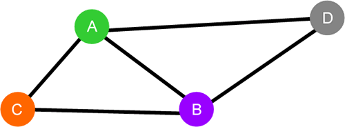

### 路径

在给定的图存储结构中，从某一顶点到另一个顶点所经过的多条边称为路径。

例如在图 1 所示的图结构中，从顶点 A 到 B 的路径有多条，包括 A-B、A-C-B 和 A-D-B。当我们给图中的每条边赋予相应的权值后，就可以从众多路径中找出总权值最小的一条，这条路径就称为最短路径。

### 最短路径算法

常用的查找最短路径的算法有 4 种，下表给出了它们各自的名称和特点。

| 最短路径算法                                                 | 描 述                                                        |
| ------------------------------------------------------------ | ------------------------------------------------------------ |
| [迪杰斯特拉算法](http://c.biancheng.net/algorithm/dijkstra.html)（Dijkstra） | 寻找某个特定顶点到其它所有顶点的最短路径，该算法要求所有路径的权值为非负数。 |
| [弗洛伊德算法（](http://c.biancheng.net/algorithm/floyd-warshall.html)Floyd-Warshall） | 寻找各个顶点之间的最短路径，允许非环路的路径权值为负数，该算法不仅适用于稀疏图，在稠密图（路径数量多的图）中寻找最短路径的效率也很高。 |
| 贝尔曼福特算法（Bellman-Ford）                               | 寻找某个特定顶点到其它所有顶点的最短路径，该算法允许路径的权值为负数。  推荐阅读：[图解贝尔曼福特算法](https://blog.csdn.net/a8082649/article/details/81812000)：详尽的讲解过程和丰富的实例演示，最终用 Java 语言实现该算法。 |
| 约翰逊算法（Johnson）                                        | 寻找各个顶点之间的最短路径，允许非环路的路径权值为负数，该算法更适用于稀疏图（路径数量少的图）。  推荐阅读：[Johnson 全源最短路径算法](https://blog.csdn.net/aijianxie8808/article/details/101647844)：详细讲解了 Johnson 算法的实现过程，最终实现的演示代码用 C# 实现。[Johnson 全源最短路径算法](https://www.cnblogs.com/mk-oi/p/13604088.html)：以作者自身的理解讲解了 Johnson 算法，最终实现的演示程序用 C++ 实现。 |