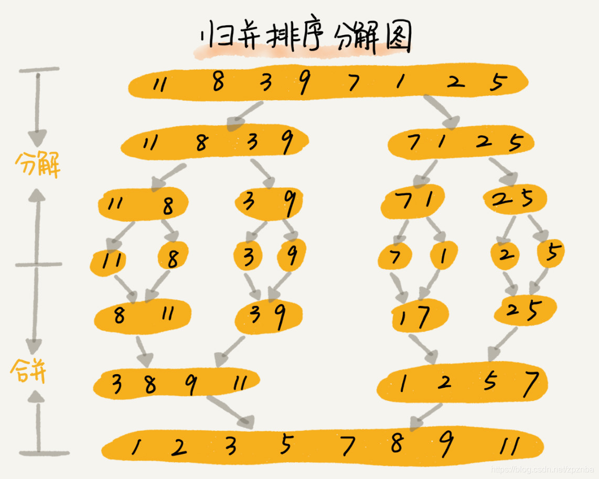

**分治的思想**。




```C++
#include<iostream>
 
using namespace std;
 
void Merge(int arr[], int l, int q, int r){
    int n=r-l+1;//临时数组存合并后的有序序列
    int* tmp=new int[n];
    int i=0;
    int left=l;
    int right=q+1;
    while(left<=q && right<=r)
        tmp[i++] = arr[left]<= arr[right]?arr[left++]:arr[right++];
    while(left<=q)
        tmp[i++]=arr[left++];
    while(right<=r)
        tmp[i++]=arr[right++];
    for(int j=0;j<n;++j)
        arr[l+j]=tmp[j];
    delete [] tmp;//删掉堆区的内存
}
 
void MergeSort(int arr[], int l, int r){
    if(l==r)
        return;  //递归基是让数组中的每个数单独成为长度为1的区间
    int q = (l + r)/2;
    MergeSort(arr, l, q);//左边
    MergeSort(arr, q + 1, r);//右边
    Merge(arr, l, q, r);
    
}
 
int main(){
    int a[8] = {3,1,2,4,5,8,7,6};
    MergeSort(a,0,7);
    for(int i=0;i<8;++i)
        cout<<a[i]<<" ";
}
```

#### 代码解析

- 每个子域内又分两个子域，换成编程语言就是函数里面递归两个函数，如上所示。

#### 快速合并

```C++
class Solution {
public:
    void merge(vector<int>& A, int m, vector<int>& B, int n) {
        int ia = m - 1, ib = n - 1, icur = m + n - 1;
        while(ia >= 0 && ib >= 0) {
            A[icur--] = A[ia] >= B[ib] ? A[ia--] : B[ib--];
        }
        while(ib >= 0) {
            A[icur--] = B[ib--];
        }
    }
};
```


### 时间复杂度

#### 分

我们需要对一个包含`n`个数的序列使用归并排序，并且使用的是递归的实现方式，那么过程如下：

- 递归的第一层，将`n`个数划分为`2`个子区间，每个子区间的数字个数为`n/2`；
- 递归的第二层，将`n`个数划分为`4`个子区间，每个子区间的数字个数为`n/4`；
- ……
- 递归的第`logn`层，将`n`个数划分为`n`个子区间，每个子区间的数字个数为`1`；

#### 治

即`merge`操作，从最底层开始，对相邻两个子区间合并；

- 在第`logn`层（最底层），每个子区间的长度为`1`，共`n`个子区间，每相邻两个子区间进行合并，总共合并`n/2`次。`n`个数字都会被遍历一次，所有这一层的总时间复杂度为`O（n）`
- ……
- 在第二层，每个子区间长度为`n/4`，总共有`4`个子区间，每相邻两个子区间进行合并，总共合并`2`次。`n`个数字都会被遍历一次，所以这一层的总时间复杂度为`O（n）`
- 在第一层，每个子区间长度为`n/2`，总共有`2`个子区间，只需要合并一次。`n`个数字都会被遍历一次，所以这一层的总时间复杂度为`O（n）`

所以总的时间复杂度为$O(nlogn)$。


### 特点

平均时间、最好和最坏情况都是一样的复杂度


参考：[快速排序和归并排序的时间复杂度分析——通俗易懂 - 特务依昂 - 博客园 (cnblogs.com)](https://www.cnblogs.com/tuyang1129/p/12857821.html#:~:text=了解归并排序的应该,序列不同而产生波动。)