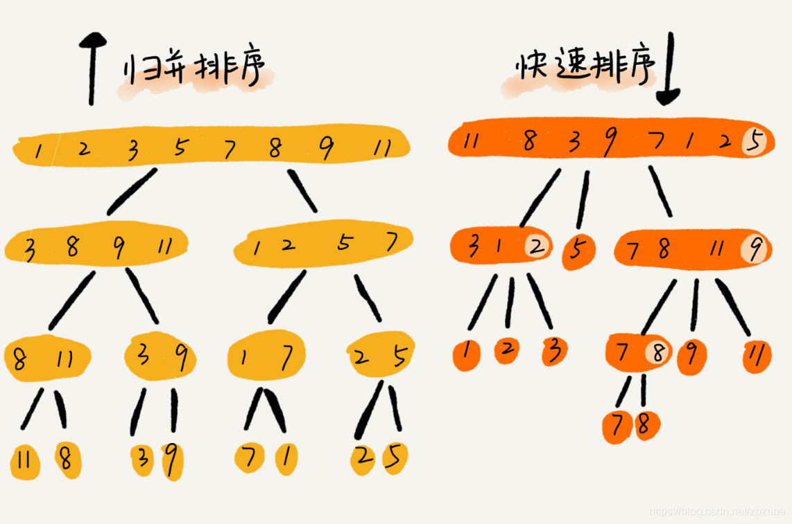
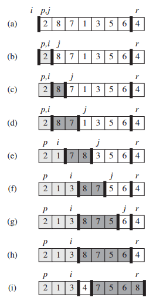

## 0. 快速排序（quick sort）

- 在STL中命名为qsort函数；
### 算法思想
数组分为左右两队，中间的值为`flag`，左边的数组全小于flag，右边的全大于flag；



注意图上的4个下标索引；

### 计算复杂度

快速排序的时间复杂度在`O（nlogn）~ O（n^2）`之间，下面我就来分别分析这两种情况：

#### 最好情况

**在理想的情况下，我们选取的轴刚好就是这个区间的中位数**。也就是说，在操作之后，正好将区间分成了数字个数相等的左右两个子区间。此时就和归并排序基本一致了：

- 递归的第一层，`n`个数被划分为`2`个子区间，每个子区间的数字个数为`n/2`；
- 递归的第二层，`n`个数被划分为`4`个子区间，每个子区间的数字个数为`n/4`；
- 递归的第三层，`n`个数被划分为`8`个子区间，每个子区间的数字个数为`n/8`;

  ......

- 递归的第`logn`层，`n`个数被划分为`n`个子区间，每个子区间的数字个数为`1`；

以上过程与归并排序基本一致，而区别就是，归并排序是从最后一层开始进行`merge`操作，**自底向上**；而快速排序则是从第一层开始，**交换区间中**数字的位置，也就是**自顶向下**。

但是，`merge`操作和快速排序的调换位置操作，时间复杂度是一样的，对于每一个区间，处理的时候，都需要遍历一次区间中的每一个元素。这也就意味着，快速排序和归并排序一样，每一层的总时间复杂度都是`O（n）`，因为需要对每一个元素遍历一次。而且在最好的情况下，同样也是有`logn`层，所以快速排序最好的时间复杂度为`O（nlogn）`。

#### 最坏情况

**对于每一个区间，我们在处理的时候，选取的轴刚好就是这个区间的最大值或者最小值**。

于是第一次操作，在经过调换元素顺序的操作后，最小值被放在了第一个位置，剩余`n-1`个数占据了`2到n`个位置；第二次操作，处理剩下的`n-1`个元素，又将这个子区间的最小值放在了当前区间的第`1`个位置，以此类推......每次操作，都只能将最小值放到第一个位置，而剩下的元素，则没有任何变化。

所以对于`n`个数来说，需要操作`n`次，才能为`n`个数排好序。而每一次操作都需要遍历一次剩下的所有元素，这个操作的时间复杂度是`O（n）`，所以总时间复杂度为`O（n^2）`。（类似冒泡？）

### 步骤
1. p为头，r为尾；**j负责循环，i负责标记当前比较小的值**；
2. j循环，当(a[j]<a[r])，exchange a[i] with a[j]；
3. 循环结束，exchange a[i+1] with a[r]; 此时a[i+1]为`flag`；
4. 重复2；

```c++
#include<iostream>
using namespace std;
 

int partition(vector<int> &vi, int low, int up)
{
	int pivot = vi[up];//以最后一个值作为基准；
	int i = low-1;
	for (int j = low; j < up; j++)
	{
		if(vi[j] <= pivot)//比基准小的
		{
			i++;
			swap(vi[i], vi[j]); //交换到前面位置；
		}
	}
	swap(vi[i+1], vi[up]);//给定基准的坐标；
	return i+1;

void quickSort(vector<int> &vi, int low, int up)
{
	if(low < up)//注意判断标准（mid+1可能大于up)
	{
		int mid = partition(vi, low, up);
		//Watch out! The mid position is on the place, so we don't need to consider it again.
		//That's why below is mid-1, not mid! Otherwise it will occur overflow error!!!
		quickSort(vi, low, mid-1);
		quickSort(vi, mid+1, up);
	}
}

void qSort(vector<int> &vi)
{
	quickSort(vi, 0, vi.size()-1);
}

int main()
{
	int a[10];
	for (int i = 0; i < 10; i++)
	{
		a[i] = rand() % 10;
		printf("%d ", a[i]);
	}
	printf("\n");
	quickSort(a, 0, 9);
	for (int i = 0; i < 10; i++)
	{
		printf("%d ", a[i]);
	}
	printf("\n");
	system("pause");
	return 0;
}
```

### 改进版本
随机化快速排序  
随机选取一个数组元素作为主元而不是a[r]；


```C++
class Solution {
public:
    int partition(vector<int>& a, int low, int high, int k){
        //随机快排划分
        swap(a[low], a[rand() % (high - low + 1) + low]);
        int v = a[low];
        int i = low + 1;
        int j = high;
        while(true){
            //小于标杆的在右
            while(j >= low + 1 && a[j] < v) 
                j--;
            //大于标杆的在左
            while(i <= high && a[i] > v) 
                i++;
            if(i > j) 
                break;
            swap(a[i], a[j]);
            i++;
            j--;
        }
        swap(a[low], a[j]);
        //从0开始，所以为第j+1大
        if(j + 1 == k)
            return a[j];
        //继续划分
        else if(j + 1 < k)
            return partition(a, j + 1, high, k);
        else
            return partition(a, low, j - 1, k);
    }
    int findKth(vector<int> a, int n, int K) {
        return partition(a, 0, n - 1, K);
    }
};
```

