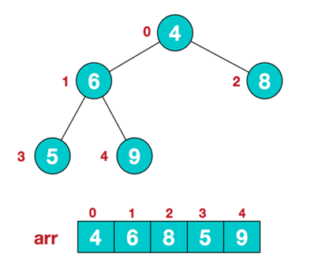
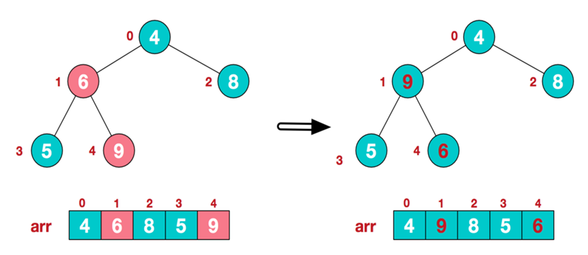
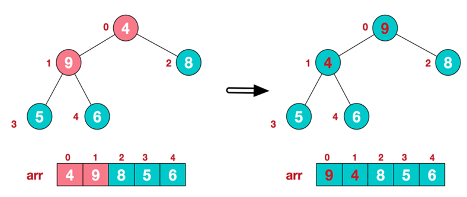
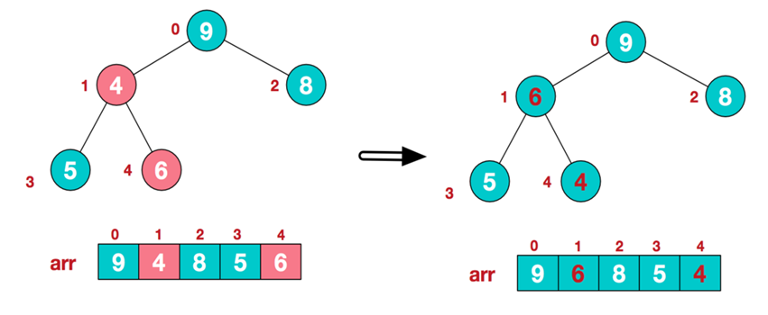
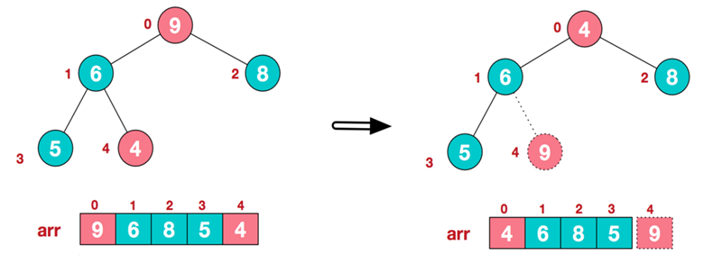
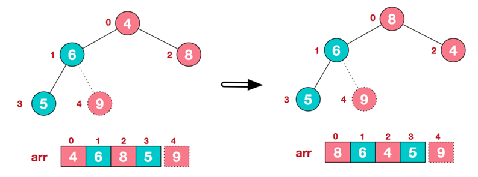
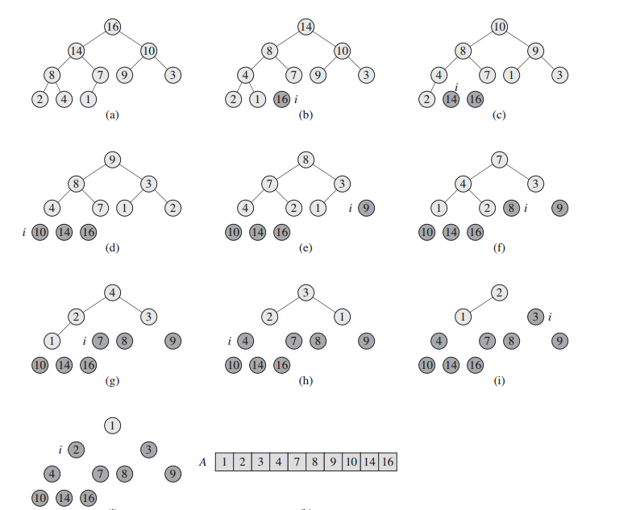

[TOC]


## 1. 堆排序（heapsort）
### 1.1 细节
结构为二叉树，可以分为最大堆和最小堆；  
最大堆中每一个子节点都**小于等于**父节点；  
最小堆中每一个子节点都**大于等于**父节点；  
时间复杂度和快速排序（qsort函数）一样，但慢一些；不过最坏情况仍然有$$O(NlogN)$$，

#### 步骤一

建立大堆根（n个元素）









#### 步骤二

**交换堆元素（交换堆首和堆尾元素--获得最大元素）**



#### 步骤三

**重建大根堆（前n-1个元素）**




重复执行步骤二和三。

### 1.2 实现
1. 利用给定数组创建一个堆H[0..n-1]（我们这里使用最小堆），输出堆顶元素
2. 以最后一个元素代替堆顶，调整成堆，**输出堆顶元素**
3. 把堆的尺寸缩小1
4. 重复步骤2，直到堆的尺寸为1

```c++
#include <iostream>
#include <vector>

//辅助交换函数
void Swap(int &a, int &b)
{
	int temp = a;
	a = b;
	b = temp;
}

//堆排序的核心是建堆,传入参数为数组，根节点位置，数组长度
void Heap_build(int a[],int root,int length)
{
	int lchild = root*2+1;//根节点的左子结点下标
	if (lchild < length)//左子结点下标不能超出数组的长度
	{
		int flag = lchild;//flag保存左右节点中最大值的下标
		int rchild = lchild+1;//根节点的右子结点下标
		if (rchild < length)//右子结点下标不能超出数组的长度(如果有的话)
		{
			if (a[rchild] > a[flag])//找出左右子结点中的最大值
			{
				flag = rchild;
			}
		}
		if (a[root] < a[flag])
		{
			//交换父结点和比父结点大的最大子节点
			Swap(a[root],a[flag]);
			//从此次最大子节点的那个位置开始递归建堆
			Heap_build(a,flag,length);
		}
	}
}
// len is the length of input array;
// a/2 will throw the portion.
void Heap_sort(int a[],int len)
{
	// 这个for循环实现了第2步，下图的图a，建立了一个最大堆；
	for (int i = len/2; i >= 0; --i)//从最后一个非叶子节点的父结点开始建堆
	{
		Heap_build(a,i,len);
	}

	// 这里用for逐步输出每一个堆顶的值；注意，j表示元素数目，一直在减少。
	for (int j = len-1; j > 0; --j)//j表示数组此时的长度，因为len长度已经建过了，从len-1开始
	{
		Swap(a[0],a[j]);//交换首尾元素,将最大值交换到数组的最后位置保存
		Heap_build(a,0,j);//去除最后位置的元素重新建堆，此处j表示数组的长度，最后一个位置下标变为len-2
	}

}
```



### 1.3 实例（改进算法）
优先队列Priority_Queue

### 计算复杂度

#### 1. 建堆

初始化+调整堆；

假设高度为$k$，则从倒数第二层右边的节点开始，这一层的节点都要执行子节点比较然后交换（如果顺序是对的就不用交换）；倒数第三层呢，则会选择其子节点进行比较和交换，如果没交换就可以不用再执行下去了。如果交换了，那么又要选择一支子树进行比较和交换；

那么总的时间计算为：$s = 2^{( i - 1 )} * ( k - i )$；其中 $i$ 表示第几层，$2^{( i - 1)}$ 表示该层上有多少个元素，$( k - i) $表示子树上要比较的次数，如果在最差的条件下，就是比较次数后还要交换；因为这个是常数，所以提出来后可以忽略；

​    $S = 2^{(k-2)} * 1 + 2^{(k-3)}*2.....+2^{0}*(k-1)$  ===> 因为叶子层不用交换，所以$i$从 $k-1$ 开始到 $1$；

求和得到$S = 2^k -k -1$，又因为k为完全二叉树的深度，所以 $(2^k) <=  n < (2^k  -1 )$，总之可以认为：$k = logn$ （实际计算得到应该是 $log(n+1) < k <= logn $;

​    综上所述得到：$S = n - logn -1$，所以时间复杂度为：$O(n)$

#### 2. 循环

在将堆顶点的元素放到堆尾(堆减1)，需要对堆进行重建，只需要对堆的顶点调用adjustheap()函数。

每次重建意味着有一个节点出堆，所以需要将堆的容量减一。adjustheap()函数的时间复杂度**k=log(n)**(顶点需要上下比较的次数为$k$,$k$为堆的层数)。所以在每次重建时，随着堆的容量的减小，层数会下降，函数时间复杂度会变化。重建堆一共需要$n-1$次循环，每次循环的比较次数为$log(i)$，则相加为：$log2+log3+…+log(n-1)+log(n)≈log(n!)$。可以证明$log(n!)$和$nlog(n)$是同阶函数：
　　

$$∵(n/2)n/2≤n!≤nn$$
$$∴n/4log(n)=n/2log(n1/2)≤n/2log(n/2)≤log(n!)≤nlog(n)$$
　　

所以时间复杂度为$O(nlogn)$

#### 总结

初始化建堆的时间复杂度为$O(n)$，排序重建堆的时间复杂度为$nlog(n)$，所以总的时间复杂度为$O(n+nlogn)=O(nlogn)$。另外堆排序的比较次数和序列的初始状态有关，但只是在序列初始状态为堆的情况下比较次数显著减少，在序列有序或逆序的情况下比较次数不会发生明显变化。