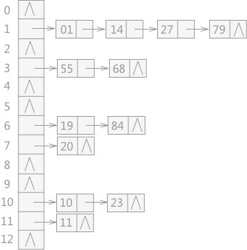

哈希地址=f(key)

哈希地址只是表示在查找表中的存储位置，而不是实际的物理存储位置。f（）是一个函数，通过这个函数可以快速求出该关键字对应的的数据的哈希地址，称之为“哈希函数”。

### 构造哈希函数

常用的哈希函数的构造方法有 6 种：直接定址法、数字分析法、平方取中法、折叠法、除留余数法和随机数法。

**直接定址法**：其哈希函数为一次函数，即以下两种形式：

```
H（key）= key 或者 H（key）=a * key + b
```

**数字分析法**:如果关键字由多位字符或者数字组成，就可以考虑抽取其中的 2 位或者多位作为该关键字对应的哈希地址，在取法上尽量选择变化较多的位，避免冲突发生。

**平方取中法**是对关键字做平方操作，取中间得几位作为哈希地址。此方法也是比较常用的构造哈希函数的方法。

**折叠法**是将关键字分割成位数相同的几部分（最后一部分的位数可以不同），然后取这几部分的叠加和（舍去进位）作为哈希地址。此方法适合关键字位数较多的情况。

除留余数法：若已知整个哈希表的最大长度 m，可以取一个不大于 m 的数 p，然后对该关键字 key 做取余运算，即：`H（key）= key % p`。

> 在此方法中，对于 p 的取值非常重要，由经验得知 p 可以为不大于 m 的质数或者不包含小于 20 的质因数的合数。

随机数法：是取关键字的一个随机函数值作为它的哈希地址，即：`H（key）=random（key）`，此方法适用于关键字长度不等的情况。

注意：这里的随机函数其实是伪随机函数，随机函数是即使每次给定的 key 相同，但是 H（key）都是不同；而伪随机函数正好相反，每个 key 都对应的是固定的 H（key）。

#### 选择函数

- 关键字的长度。如果长度不等，就选用随机数法。如果关键字位数较多，就选用折叠法或者数字分析法；反之如果位数较短，可以考虑平方取中法；
- 哈希表的大小。如果大小已知，可以选用除留余数法；
- 关键字的分布情况；
- 查找表的查找频率；
- 计算哈希函数所需的时间（包括硬件指令的因素）

### 处理冲突

**开放定址法** H（key）=（H（key）+ d）MOD m（其中 m 为哈希表的表长，d 为一个增量） 当得出的哈希地址产生冲突时，选取以下 3 种方法中的一种获取 d 的值，然后继续计算，直到计算出的哈希地址不在冲突为止，这 3 种方法为：

- 线性探测法：d=1，2，3，…，m-1
- 二次探测法：d=12，-12，22，-22，32，…
- 伪随机数探测法：d=伪随机数

**再哈希法**

当通过哈希函数求得的哈希地址同其他关键字产生冲突时，使用另一个哈希函数计算，直到冲突不再发生。

**链地址法**

将所有产生冲突的关键字所对应的数据全部存储在同一个线性[链表](http://c.biancheng.net/view/3336.html)中。例如有一组关键字为`{19,14,23,01,68,20,84,27,55,11,10,79}`，其哈希函数为：`H(key)=key MOD 13`，使用链地址法所构建的哈希表如图 3 所示：



- 建立一个公共溢出区
  建立两张表，一张为基本表，另一张为溢出表。基本表存储没有发生冲突的数据，当关键字由哈希函数生成的哈希地址产生冲突时，就将数据填入溢出表。