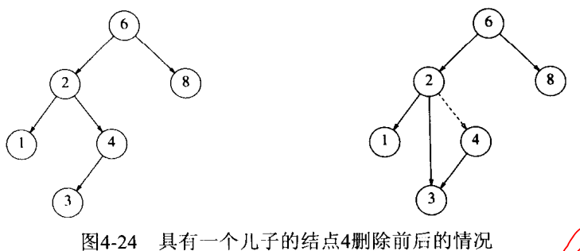

# 树


STL中set和map的实现基础。

#### 定义

定义树的一种自然方法是递归。

深度：根到当前结点位移路径的长（即路径上边的条数）

高：从当前结点到一片树叶最长路径的长。所有树叶的高都是0. 而树的高等于它的根的高

度：节点的子树数目就是节点的度。比如二叉树的度小于等于２。

叶子节点：度为零的节点就是叶子节点

树中结点数 = 总分叉数 +1。(这里的分叉数就是所有结点的度之和)，如二叉树结点为３，为２；

#### 实现

因为每个结点儿子数可能变化很大且事先不知道，因为将每个结点的**所有儿子**放在树节点的链表中

```c++
//Definition for binary tree
struct TreeNode {
    int val;
    TreeNode *left;
    TreeNode *right;
    TreeNode(int x) : val(x), left(NULL), right(NULL) {}
};
```


## 二叉树

结点不多于两个儿子；
**平均深度**为$$\sqrt N$$，

二叉树的存储：  


### 1.1 二叉树的表示

#### 1. 数组表示


数组对满二叉树的表示非常有效，但对一般二叉树的表示会造成极大的浪费。  

#### 2. 链表


### 1.2 遍历
#### 1.2.1 深度优先

假定左右等价，这里只考虑先左后右

#### 中序遍历（LVR）
如：表达式树：树叶都是操作数，而其他父结点都是操作符。  


$$a+b*(c-d)-e/f$$

```c++
void pre_scanf(TreeNode* t){
    if (t == NULL)
        return;
    
    else
        pre_scanf(t->left);
    	count << t->val;
    	pre_scanf(t->right);
        
}
```


#### 前序遍历（VLR）：结点在儿子之前处理

$$-+a*b-cd/ef$$  

先对结点处理，再对儿结点处理；

```c++
void pre_scanf(TreeNode* t){
    if (t == NULL)
        return;
    count << t->val;
    else
        pre_scanf(t->left);
    	pre_scanf(t->right);
        
}
```


#### 后序遍历（LRV）：结点在儿子之后处理

$$abcd-*+ef/-$$

可以用于计算节点个数或者二叉树高度（depth）

```c++
void pre_scanf(TreeNode* t){
    if (t == NULL)
        return;
    
    else
        pre_scanf(t->left);
    	pre_scanf(t->right);
    	count << t->val;
        
}
```


#### 1.2.2 广度优先
也叫层序遍历。

主要是从左向右，自上而下

$$-+/a*efb-cd$$​

```C++
//层序遍历二叉树：从上到下，从左到右
void fromTopToBottomScanf(TreeNode* t)
{
	if (t==NULL)
	{
		return;
	}
	deque<TreeNode*> dequeTreeNode;
	dequeTreeNode.push_back(t);
 
	while (dequeTreeNode.size())
	{
		TreeNode* pNode = dequeTreeNode.front(); //依次取出队列中的头部元素进行打印
		dequeTreeNode.pop_front(); //
 
		cout << pNode->val << " ";
		if (pNode->left)
		{
			dequeTreeNode.push_back(pNode->left);
		}
		if (pNode->right)
		{
			dequeTreeNode.push_back(pNode->right);
		}
	}
}
```


### 1.3 二叉查找树
左结点**所有值**<父结点所有值<右结点所有值；二分查找发的时间复杂度是$$O(lof N)$$，不用担心栈空间被用完；  
在二叉查找树中，数据可以是一个复杂类型（比如类？，包含雇员编号，姓名等），然后通过重载操作符<实现查找和比较。


#### contains
函数功能：如果树T中由项位x的结点，contains返回true，否则返回false，  
当T为空，也返回false，如果存在，返回true；如果两种情况都不存在，则对子树进行**递归调用**；比较X与树T中的项的大小，决定往左子树还是右子树递归。  
**注意：为保证稳健性，需要先测试树是否为空**。  

**Tips：**可以递归实现，也可以非递归实现  
递归可以用while循环实现；  

```C++
// 使用递归实现findMin
BinaryNode *findMin(BinaryNode *t) const
{
    if(t==NULL)
    	return NULL;
    if(t->right==NULL)
    	return t;
    return findMin(t->left);    
}

// 使用while实现findMax
BinaryNode *findMax(BinaryNode *t) const
{
    if(t!=NULL)
    	while(t->right!=NULL)
    	//注意这里对t的改变是安全的，因为我们只用指针的副本来工作，但还是要小心；
    	//比图t->right=t->right->right这样的语句会产生一些变化。
    		t=t->right;
    return
}
```


#### insert


重复元的插入比较复杂：可以通过在结点记录中保留一个附加字段以指示此数据元出现的频率；  
但是，如果重载了操作符<，可能就行不通。此时可以把具有相同键的所有结构保留在一个辅助数据结构中，如表或者另一颗查找树。
#### remove
只有一个儿结点



两个儿结点：先找到并替代，然后递归删除。  


先用右子树中**先**最小的数据代替要删除的几点数据，**然后递归**地删除那个结点。其实还有更有效率的方法。  
**懒惰删除lazy deletion**：被删项仍然留在树中，但做了一个被删除的记号。


