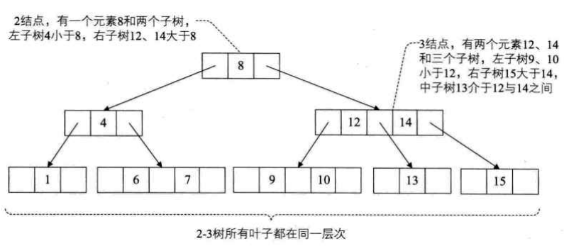
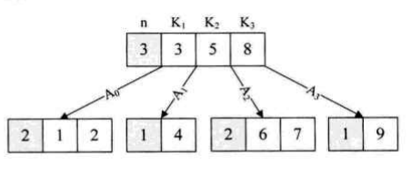

平衡二叉树由于树深度过大而造成磁盘IO读写过于频繁，进而导致效率低下。所以，我们为了减少磁盘ＩＯ的次数，所以必须**降低树的深度**。基本想法：

- 每个节点存储多个元素
- 采用多叉树

### 多路查找树

muiti-way search tree；**每一个结点的孩子树可以多于两个，且每一个结点处可以存储多个元素**

#### 2-3树

#### 2-3-4树

2-3-4树就是2-3树的拓展，包括了4结点的使用。一个4结点包含小中大三个数据元素和四个孩子（或没有孩子），一个4结点要么没有孩子，要么有4个孩子。如果某个4结点有孩子的话，左子树包含小于最小元素的元素；第二子树包含大于最小元素，小于第二元素的元素；第三子树包含大于第二元素，小于最大元素的元素；右子树包含大于最大元素的元素。

### B树

B树（B-Tree）是一种平衡的多路查找树，2-3树和2-3-4树都是B树的特例。结点最大的孩子数目称为B树的阶（order），因此，2-3树是3阶B树，2-3-4树是4阶B树。

一个m阶的B树具有如下属性：

- 如果根结点不是叶结点，则其至少有两个子树
- 每一个非根的分支结点都有k-1个元素和k个孩子，其中【m/2】≤k≤m。每一个叶子结点n都有k-1个元素，其中【m/2】≤k≤m。
- 所有叶子结点都位于同一层次
- 所有分支结点包含下列信息数据（n,A0,K1,A1,K2,A2,...,Kn,An），其中：Ki（i=1,2,...,n）为关键字，且Ki<Ki+1（i=1,2,...n-1）;Ai（i=0,1,2,...n）为指向子树根结点的指针，且指针Ai-1所指子树中所有结点的关键字均小于Ki（i=1,2,...,n），An所指子树中所有结点的关键字均大于Kn，n（【m/2】- 1≤ n ≤m - 1）为关键字的个数（或n+1为子树的个数）。

参考：[数据结构（四十一）多路查找树（B树） - BigJunOba - 博客园 (cnblogs.com)](https://www.cnblogs.com/BigJunOba/p/9288150.html)