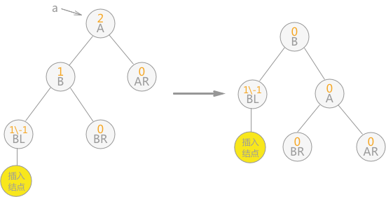
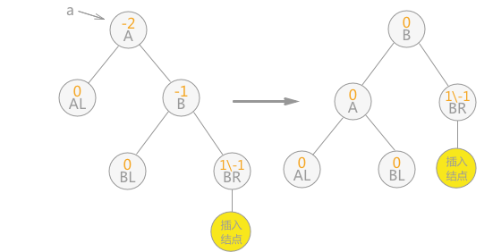
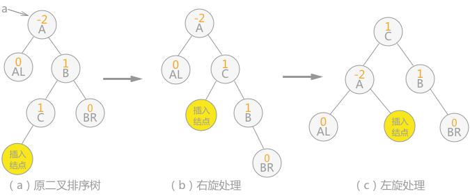

### 1.4 AVL树

如果向一棵预先排序的数插入数据，会花费二次时间，而是实现代价巨大，此时树将由没有左儿子的结点组成。一种解决办法是：用平衡树，任何结点的深度都不能过深。

有很多算法实现平衡树，但是大部分比标准二叉查找树复杂很多，花费时间很长。

AVL是一种最老的平衡查找树。较新的方法是允许树有任意深度，但每次操作后要调整，，这种叫做自调整类结构。即伸展树。

- 一种带有高度平衡条件的二叉查找树；
- 保证深度为O（log N）；
- 平衡因子：每个结点都有其各自的平衡因子，表示的就是其左子树深度同右子树深度的差。平衡二叉树中各结点平衡因子的取值只可能是：0、1 和 -1

一棵AVL树是每个结点的左子树和右子树的**高度最多差1**的二叉查找树（空树的高度定义为1）。


#### 旋转

插入操作可能会破坏AVL的平衡条件，所以需要**旋转**；可能的情况为：  

1. A结点的左（右）儿子的左（右）子树进行一次插入；这种情况需要**单旋转**；
2. A结点的左（右）儿子的右（左）子树进行一次插入；这种情况需要**双旋转**；

### 不平衡的情况

#### 单向右旋



若由于结点 a 的左子树为根结点的左子树上插入结点，导致结点 a 的平衡因子由 1 增至 2，

#### 单向左旋



如果由于结点 a 的右子树为根结点的右子树上插入结点，导致结点 a 的平衡因子由 -1变为 -2

#### 双向旋转-先左后右


#### 双向旋转（先右后左）



#### 编程实现

```C
#include <stdio.h>
#include <stdlib.h>
//分别定义平衡因子数
#define LH +1
#define EH  0
#define RH -1
typedef int ElemType;
typedef enum {false,true} bool;
//定义二叉排序树
typedef struct BSTNode{
    ElemType data;
    int bf;//balance flag
    struct BSTNode *lchild,*rchild;
}*BSTree,BSTNode;
//对以 p 为根结点的二叉树做右旋处理，令 p 指针指向新的树根结点
void R_Rotate(BSTree* p)
{
    //借助文章中的图 5 所示加以理解，其中结点 A 为 p 指针指向的根结点
    BSTree lc = (*p)->lchild;
    (*p)->lchild = lc->rchild;
    lc->rchild = *p;
    *p = lc;
}
////对以 p 为根结点的二叉树做左旋处理，令 p 指针指向新的树根结点
void L_Rotate(BSTree* p)
{
    //借助文章中的图 6 所示加以理解，其中结点 A 为 p 指针指向的根结点
    BSTree rc = (*p)->rchild;
    (*p)->rchild = rc->lchild;
    rc->lchild = *p;
    *p = rc;
}
//对以指针 T 所指向结点为根结点的二叉树作左子树的平衡处理，令指针 T 指向新的根结点
void LeftBalance(BSTree* T)
{
    BSTree lc,rd;
    lc = (*T)->lchild;
    //查看以 T 的左子树为根结点的子树，失去平衡的原因，如果 bf 值为 1 ，则说明添加在左子树为根结点的左子树中，需要对其进行右旋处理；反之，如果 bf 值为 -1，说明添加在以左子树为根结点的右子树中，需要进行双向先左旋后右旋的处理
    switch (lc->bf)
    {
        case LH:
            (*T)->bf = lc->bf = EH;
            R_Rotate(T);
            break;
        case RH:
            rd = lc->rchild;
            switch(rd->bf)
        {
            case LH:
                (*T)->bf = RH;
                lc->bf = EH;
                break;
            case EH:
                (*T)->bf = lc->bf = EH;
                break;
            case RH:
                (*T)->bf = EH;
                lc->bf = LH;
                break;
        }
            rd->bf = EH;
            L_Rotate(&(*T)->lchild);
            R_Rotate(T);
            break;
    }
}
//右子树的平衡处理同左子树的平衡处理完全类似
void RightBalance(BSTree* T)
{
    BSTree lc,rd;
    lc= (*T)->rchild;
    switch (lc->bf)
    {
        case RH:
            (*T)->bf = lc->bf = EH;
            L_Rotate(T);
            break;
        case LH:
            rd = lc->lchild;
            switch(rd->bf)
        {
            case LH:
                (*T)->bf = EH;
                lc->bf = RH;
                break;
            case EH:
                (*T)->bf = lc->bf = EH;
                break;
            case RH:
                (*T)->bf = EH;
                lc->bf = LH;
                break;
        }
            rd->bf = EH;
            R_Rotate(&(*T)->rchild);
            L_Rotate(T);
            break;
    }
}

int InsertAVL(BSTree* T,ElemType e,bool* taller)
{
    //如果本身为空树，则直接添加 e 为根结点
    if ((*T)==NULL)
    {
        (*T)=(BSTree)malloc(sizeof(BSTNode));
        (*T)->bf = EH;
        (*T)->data = e;
        (*T)->lchild = NULL;
        (*T)->rchild = NULL;
        *taller=true;
    }
    //如果二叉排序树中已经存在 e ，则不做任何处理
    else if (e == (*T)->data)
    {
        *taller = false;
        return 0;
    }
    //如果 e 小于结点 T 的数据域，则插入到 T 的左子树中
    else if (e < (*T)->data)
    {
        //如果插入过程，不会影响树本身的平衡，则直接结束
        if(!InsertAVL(&(*T)->lchild,e,taller))
            return 0;
        //判断插入过程是否会导致整棵树的深度 +1
        if(*taller)
        {
            //判断根结点 T 的平衡因子是多少，由于是在其左子树添加新结点的过程中导致失去平衡，所以当 T 结点的平衡因子本身为 1 时，需要进行左子树的平衡处理，否则更新树中各结点的平衡因子数
            switch ((*T)->bf)
            {
                case LH:
                    LeftBalance(T);
                    *taller = false;
                    break;
                case  EH:
                    (*T)->bf = LH;
                    *taller = true;
                    break;
                case RH:
                    (*T)->bf = EH;
                    *taller = false;
                    break;
            }
        }
    }
    //同样，当 e>T->data 时，需要插入到以 T 为根结点的树的右子树中，同样需要做和以上同样的操作
    else
    {
        if(!InsertAVL(&(*T)->rchild,e,taller))
            return 0;
        if (*taller)
        {
            switch ((*T)->bf)
            {
                case LH:
                    (*T)->bf = EH;
                    *taller = false;
                    break;
                case EH:
                    (*T)->bf = RH;
                    *taller = true;
                    break;
                case  RH:
                    RightBalance(T);
                    *taller = false;
                    break;
            }
        }
    }
    return 1;
}
//判断现有平衡二叉树中是否已经具有数据域为 e 的结点
bool FindNode(BSTree root,ElemType e,BSTree* pos)
{
    BSTree pt = root;
    (*pos) = NULL;
    while(pt)
    {
        if (pt->data == e)
        {
            //找到节点，pos指向该节点并返回true
            (*pos) = pt;
            return true;
        }
        else if (pt->data>e)
        {
            pt = pt->lchild;
        }
        else
            pt = pt->rchild;
    }
    return false;
}
//中序遍历平衡二叉树
void InorderTra(BSTree root)
{
    if(root->lchild)
        InorderTra(root->lchild);
   
    printf("%d ",root->data);
   
    if(root->rchild)
        InorderTra(root->rchild);
}

int main()
{
    int i,nArr[] = {1,23,45,34,98,9,4,35,23};
    BSTree root=NULL,pos;
    bool taller;
    //用 nArr查找表构建平衡二叉树（不断插入数据的过程）
    for (i=0;i<9;i++)
    {
        InsertAVL(&root,nArr[i],&taller);
    }
    //中序遍历输出
    InorderTra(root);
    //判断平衡二叉树中是否含有数据域为 103 的数据
    if(FindNode(root,103,&pos))
        printf("\n%d\n",pos->data);
    else
        printf("\nNot find this Node\n");
    return 0;
}
```


因为一次旋转总能解决问题，所以用非递归写更好，但编程实现比较难，一般还是用递归来写。

高度信息的存储：实际需要的是高度差；可以考虑用两个二进制位（+1，0，-1）表示；

```c++
struct AvlNode{
    Comparable element;
    AvlNode *left;
    AvlNode *Right;
    int height;
    AvlNode(const Comparable & theElement, AvlNode *lt, AvlNode *rt, int h=0):
    element(theElement), left(lt),right(rt),height(h)//有参构造函数
};

void rotateWithLeftChild(AvlNode * &k2){//这里传入的是指针，指向k2
    AvlNode *k1 = k2->left; //指针减少赋值开销，只存储左子树地址；
    k2->left = k1->left;
    k1->left = k2;
    k2->height = max(height(k2->left),height(k2->right))+1;
    k1->height = max(height(k1->left),k2->right)+1;
    k2 = k1; //设置新根；因为返回值是k2，这样h可以返回新根。
}

void doubleWithLeftChild(AvlNode * & k3)
{
    rotateWithLeftChild(k3->left);
    rotateWithLeftChild(k3);
}
```

[平衡二叉树（AVL树）及C语言实现 (biancheng.net)](http://c.biancheng.net/view/3432.html)