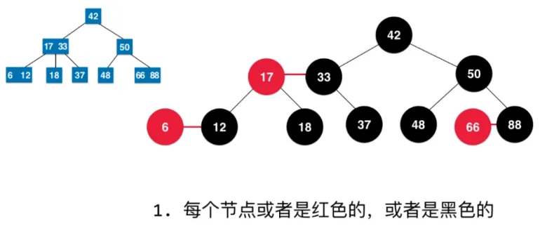

## 1. 用途
在C++ STL中，map和set都是用红黑树实现的。

## 2. 特征

AVL树的一个变种，最坏情况下操作花费$$O(log_2 N)$$；AVL子树的高度差不超过1，而红黑树的高度差不会相差二倍。  

#### 定义
它在**二叉查找树的基础上**又具备如下特征

1. 每个结点要么红色，要么黑色
2. 根是黑色
3. 每个叶子节点都是黑色的空节点（NILL节点）
4. 如果一个结点是红色，那么子结点必须黑色
5. 从一个结点到一个NULL指针的每一条路径都必须包含相同数目的黑色结点。

该规则的结论是：红黑树的高度最多$$2log(N+1)$$。

## 3. 操作
#### 1. 插入

1. 红黑树本身是一棵二叉查找树，将结点插入后，它仍然是二叉查找树。
2. 将插入的结点着色为“红色”，**这样不会违背特征5**，
3. 一系列**旋转或变色**，使之成为红黑树：由于插入只有可能违背特性4.

#### 2. 删除
对于删除后的操作，需要分为做种情况：  
case1. x的兄弟w是红色的  
case2. x的兄弟w是黑色，且w的俩个孩子也都是黑色的  
case3. x的兄弟w是黑色的，并且w的左孩子是红色，右孩子为黑色  
case4. x的兄弟w是黑色的；并且w的右孩子是红色的，左孩子任意颜色。  

### 为什么效率高

红黑树属于平衡二叉树。它不严格是因为它不是严格控制左、右子树高度或节点数之差小于等于1，但红黑树**高度**依然是平均log(n)，且最坏情况高度不会超过2log(n)。

红黑树能够以O(log2(N))的时间复杂度进行搜索、插入、删除操作。此外,任何不平衡都会在3次旋转之内解决。这一点是AVL所不具备的。

综合分析：

红黑树等价于2-3树：当需要再平衡时，2-3节点间的转换可以吸收不平衡性，减少旋转次数。

增加与删除时间与AVL树相当，但是当数据随机性很强时，3节点（颜色）的缓冲性更强，综合性能更优。所以其性能本质上是用空间换时间。