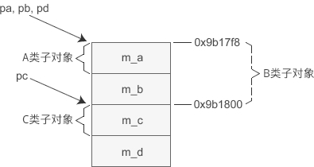

首先搞清楚D类对象的内存模型

对于下面的继承关系

其内存模型为

对象的指针必须要指向对象的起始位置；

对于 A 类和 B 类来说，它们的子对象的起始地址和 D 类对象一样所以将 pd 赋值给 pa、pb 时不需要做任何调整，直接传递现有的值即可。

而 C 类子对象距离 D 类对象的开头有一定的偏移，将 pd 赋值给 pc 时要加上这个偏移，这样 pc 才能指向 C 类子对象的起始位置。也就是说，执行`pc = pd;`语句时编译器对 pd 的值进行了调整，才导致 pc、pd 的值不同。

这与 继承顺序有关。