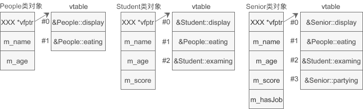

编译器之所以能通过指针指向的对象找到虚函数，是因为在**创建对象**时额外地增加了虚函数表。

```C++
#include <iostream>
#include <string>
using namespace std;

//People类
class People{
public:
    People(string name, int age);
public:
    virtual void display();
    virtual void eating();
protected:
    string m_name;
    int m_age;
};
People::People(string name, int age): m_name(name), m_age(age){ }
void People::display(){
    cout<<"Class People："<<m_name<<"今年"<<m_age<<"岁了。"<<endl;
}
void People::eating(){
    cout<<"Class People：我正在吃饭，请不要跟我说话..."<<endl;
}

//Student类
class Student: public People{
public:
    Student(string name, int age, float score);
public:
    virtual void display();
    virtual void examing();
protected:
    float m_score;
};
Student::Student(string name, int age, float score):
    People(name, age), m_score(score){ }
void Student::display(){
    cout<<"Class Student："<<m_name<<"今年"<<m_age<<"岁了，考了"<<m_score<<"分。"<<endl;
}
void Student::examing(){
    cout<<"Class Student："<<m_name<<"正在考试，请不要打扰T啊！"<<endl;
}

//Senior类
class Senior: public Student{
public:
    Senior(string name, int age, float score, bool hasJob);
public:
    virtual void display();
    virtual void partying();
private:
    bool m_hasJob;
};
Senior::Senior(string name, int age, float score, bool hasJob):
    Student(name, age, score), m_hasJob(hasJob){ }
void Senior::display(){
    if(m_hasJob){
        cout<<"Class Senior："<<m_name<<"以"<<m_score<<"的成绩从大学毕业了，并且顺利找到了工作，Ta今年"<<m_age<<"岁。"<<endl;
    }else{
        cout<<"Class Senior："<<m_name<<"以"<<m_score<<"的成绩从大学毕业了，不过找工作不顺利，Ta今年"<<m_age<<"岁。"<<endl;
    }
}
void Senior::partying(){
    cout<<"Class Senior：快毕业了，大家都在吃散伙饭..."<<endl;
}

int main(){
    People *p = new People("赵红", 29);
    p -> display();

    p = new Student("王刚", 16, 84.5);
    p -> display();

    p = new Senior("李智", 22, 92.0, true);
    p -> display();

    return 0;
}
```

#### 内存模型



仔细观察虚函数表，可以发现基类的虚函数在 vtable 中的索引（下标）是固定的，不会随着继承层次的增加而改变，派生类新增的虚函数放在 vtable 的最后。如果派生类有同名的虚函数遮蔽（覆盖）了基类的虚函数，那么将使用派生类的虚函数替换基类的虚函数，这样具有遮蔽关系的虚函数在 vtable 中只会出现一次。