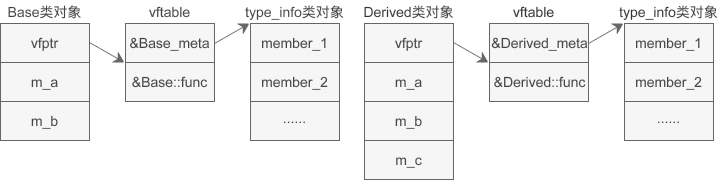

```C++
#include <iostream>
using namespace std;

//基类
class Base{
public:
    virtual void func();
protected:
    int m_a;
    int m_b;
};
void Base::func(){ cout<<"Base"<<endl; }

//派生类
class Derived: public Base{
public:
    void func();
private:
    int m_c;
};
void Derived::func(){ cout<<"Derived"<<endl; }

int main(){
    Base *p;
    int n;
  
    cin>>n;
    if(n <= 100){
        p = new Base();
    }else{
        p = new Derived();
    }
    cout<<typeid(*p).name()<<endl;

    return 0;
}
```

基类 Base 包含了一个虚函数，派生类 Derived 又定义了一个原型相同的函数遮蔽了它，这就构成了多态。p 是基类的指针，可以指向基类对象，也可以指向派生类对象；`*p`表示 p 指向的对象。

编译器在编译期间无法预估用户的输入，所以无法确定`*p`的类型

对象内存模型:

- 如果没有虚函数也没有虚继承，那么对象内存模型中只有成员变量。
- 如果类包含了虚函数，那么会额外添加一个虚函数表，并在对象内存中插入一个指针，指向这个虚函数表。
- 如果类包含了虚继承，那么会额外添加一个虚基类表，并在对象内存中插入一个指针，指向这个虚基类表。

如果类包含了虚函数，那么该类的对象内存中还会额外增加类型信息，也即 type_info 对象。

