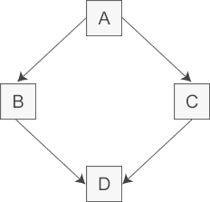

为了避免多次继承，考虑使用虚继承

使得在派生类中只保留一份间接基类的成员。

```C++
//间接基类A
class A{
protected:
    int m_a;
};

//直接基类B
class B: virtual public A{  //虚继承
protected:
    int m_b;
};

//直接基类C
class C: virtual public A{  //虚继承
protected:
    int m_c;
};

//派生类D
class D: public B, public C{
public:
    void seta(int a){ m_a = a; }  //正确
    void setb(int b){ m_b = b; }  //正确
    void setc(int c){ m_c = c; }  //正确
    void setd(int d){ m_d = d; }  //正确
private:
    int m_d;
};

int main(){
    D d;
    return 0;
}
```

这个被共享的基类就称为虚基类（Virtual Base Class），本例中的 A 就是一个虚基类。

