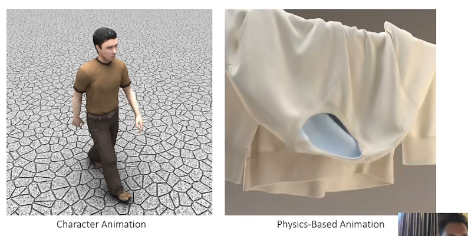

## 计算机图形学

3D场景-->二维图形

二维图形-->(重建)3D场景

#### 三类：

- 几何geometry：构造
- 渲染rendering：显示
- 模拟/动画animation：运动

**pipeline**

### 1. Geometry

### Mesh

- 一般使用三角网格
- 可以是结构化或非结构化网格

#### 点云（particle）

- 无法直接渲染，需要构造mesh
- 采样
- 近邻点

#### grid

三维格子（cell存储物理量）；常见于医学

- 内存大
- 如何渲染（转成mesh；或直接渲染）

### 2. rendering

#### 非真实渲染

游戏和设计领域

#### 真实渲染（photorealistic）

分两种：光线追踪和光栅化。

- 光线追踪
- 材质渲染

#### 扫描

### 3. animation

- 人体/角色动画
- 基于物理动画

## 用途

- 娱乐：游戏、效果显示
- CAD计算机辅助设计
- 艺术、时尚类
- VR/AR

## 基于物理的动画

#### 4类

| **Contents** | **Rigid Bodies** |              | **Cloth and Hair** |             | **Soft Bodies** |         | **Fluids**     |                  |          |
| ------------ | ---------------- | ------------ | ------------------ | ----------- | --------------- | ------- | -------------- | ---------------- | -------- |
| Effects      | Contacts         | Fracture     | Cloth              | Hair        | Elastic         | plastic | Smoke          | Drops  and Waves | Splashes |
| Mesh         | ✓                | ✓            | ✓                  | ✓           | ✓               | ✓       |                | ✓  (real-time)   | ?        |
| Particle     |                  | ☆ (meshless) |                    |             |                 |         | ✓  (real-time) |                  | ✓        |
| Grid         |                  |              | ☆ (contact)        | ☆ (contact) |                 |         | ✓              | ✓                | ✓        |