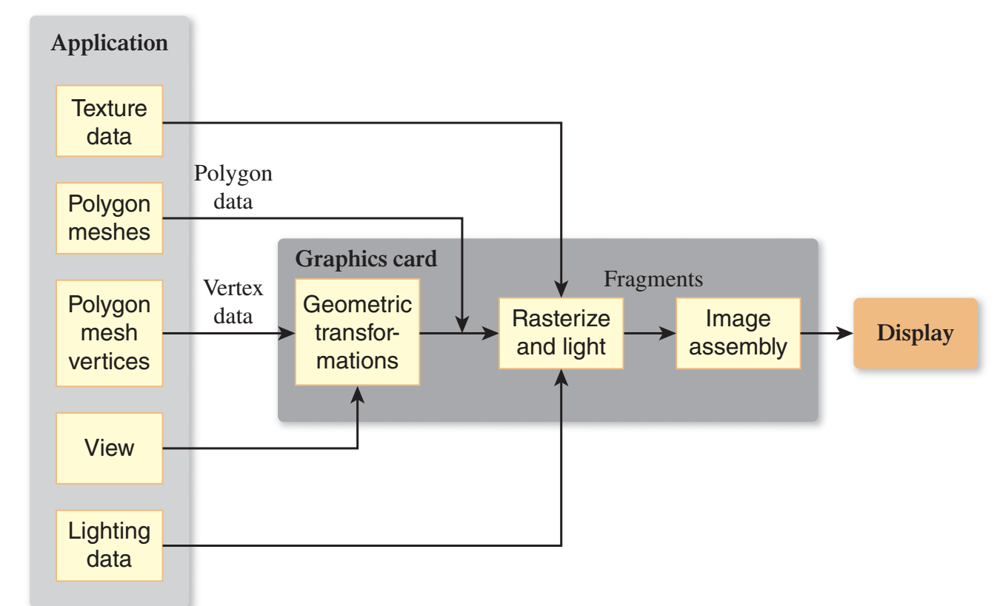
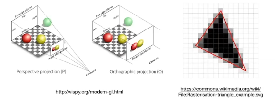
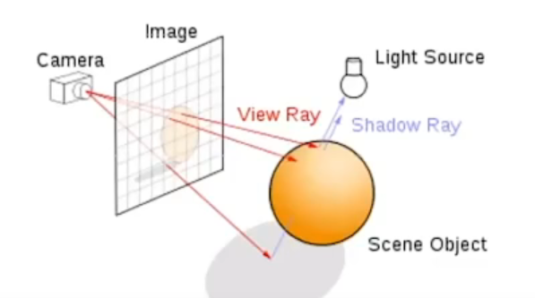

### 0. 用途

计算机图形学可以发挥作用的地方

- 游戏
- 特效
- 动作捕捉
- 动画
- CAD：辅助设计
- 可视化
- VR/AR

### graphic pipeline

### 1. 渲染

- 光栅化:三维映射到二维画面
- 曲线和曲面
- 光线追踪
- 仿真/动画

#### 图形系统

- 交互设备：鼠标等
- CPU
- GPU
- 显示：LCD、CRT、OLED